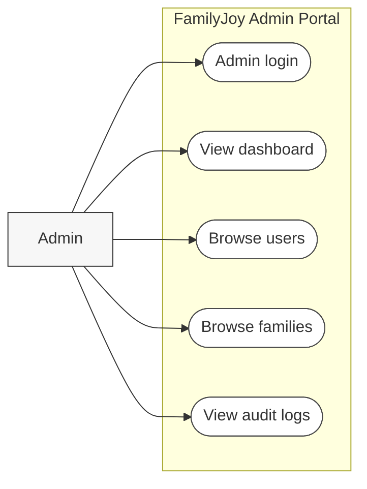

# FamilyJoy Admin Use Case Diagram

## Notes
- This diagram separates admin governance behaviour from the family-facing workflow.
- It is suitable for report sections that explain admin access, monitoring, and governance visibility.
- It can also be used in place of the admin subsection of the larger core use case diagram when a smaller figure is needed.
