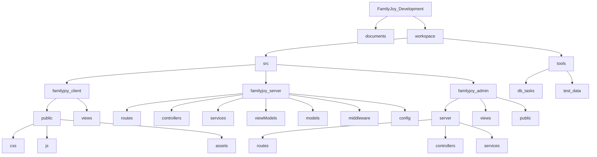
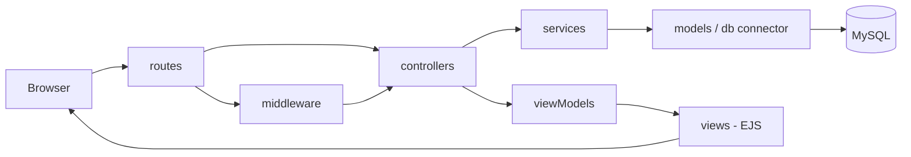
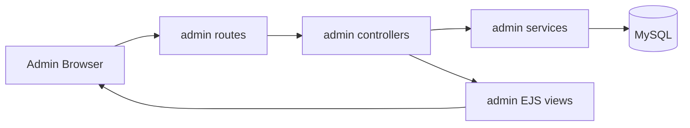

# FamilyJoy Code Structure Overview

## 1) Project Directory Map

## 2) Main App Runtime Interaction (SSR MVC Pattern)

## 3) Admin Runtime Interaction

## Notes
- `familyjoy_client/public` contains static frontend assets (CSS, JS, image assets).
- `familyjoy_server/services` is the main business logic layer.
- `familyjoy_server/routes` defines URL entry points and request mapping.
- `familyjoy_server/controllers` coordinates request/response and delegates logic to services.
- `familyjoy_admin` is isolated for admin portal pages and server flow.
- `tools` provides DB utility tasks and test data seeding scripts.
