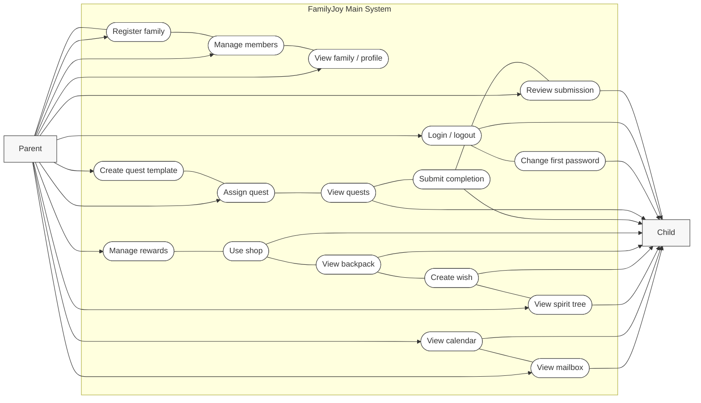

# FamilyJoy Core Use Case Diagram

## Notes
- This version compresses similar use cases so the diagram fits better in a Word document.
- Parent and child still share some access and history functions, but their workflow responsibilities remain different.
- Admin governance has been separated into `familyjoy_admin_use_case_diagram.md`.
