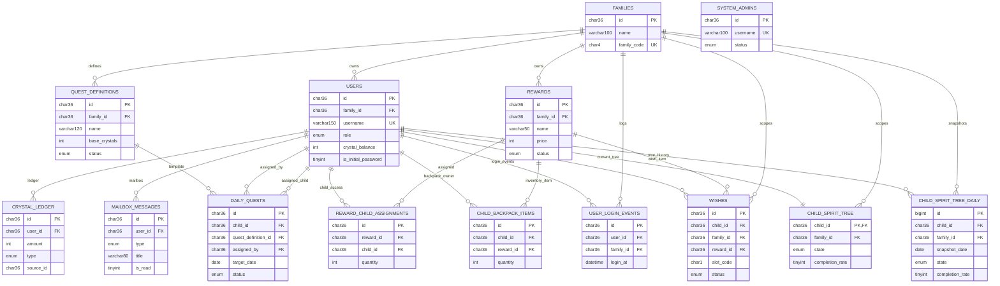

# FamilyJoy Database ER Diagram

## Notes
- `families` is the top-level ownership boundary for most business tables.
- `users`, `quest_definitions`, and `rewards` form the main operational base of the family workflow.
- `daily_quests`, `crystal_ledger`, `child_backpack_items`, `wishes`, and `child_spirit_tree` form the core child-facing interaction chain.
- `system_admins` is intentionally separate from the family-scoped application model.
