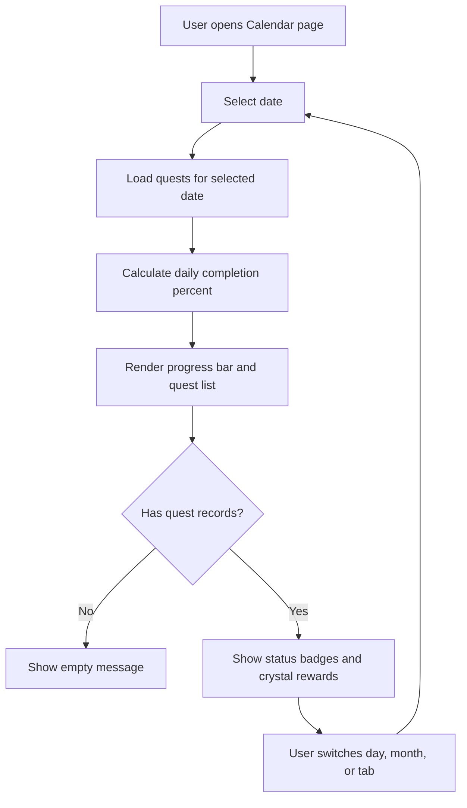

# FamilyJoy Calendar Flow

```mermaid
flowchart TD
    A[User opens Calendar page] --> B[Select date]
    B --> C[Load quests for selected date]
    C --> D[Calculate daily completion percent]
    D --> E[Render progress bar and quest list]
    E --> F{Has quest records?}
    F -->|No| G[Show empty message]
    F -->|Yes| H[Show status badges and crystal rewards]
    H --> I[User switches day, month, or tab]
    I --> B
```

## Notes
- Calendar is a history and tracking view.
- Completion data is displayed by date with status breakdown.
