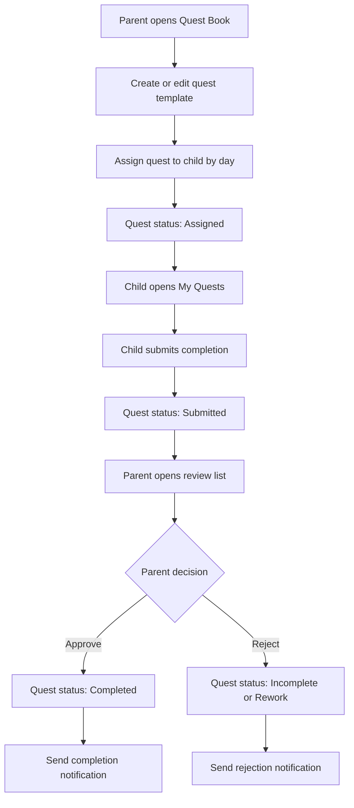

# FamilyJoy Quest Flow (Parent and Child)

```mermaid
flowchart TD
    A[Parent opens Quest Book] --> B[Create or edit quest template]
    B --> C[Assign quest to child by day]
    C --> D[Quest status: Assigned]
    D --> E[Child opens My Quests]
    E --> F[Child submits completion]
    F --> G[Quest status: Submitted]
    G --> H[Parent opens review list]
    H --> I{Parent decision}
    I -->|Approve| J[Quest status: Completed]
    I -->|Reject| K[Quest status: Incomplete or Rework]
    J --> L[Send completion notification]
    K --> M[Send rejection notification]
```

## Notes
- Parent controls template and assignment.
- Child can submit, but cannot approve.
- Approval updates final status and triggers feedback.
