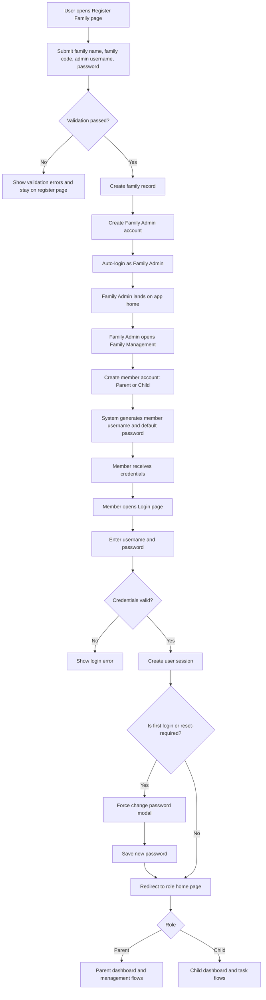

# FamilyJoy Registration to Login Flow (Family Admin and Family Members)

## Notes
- Family Admin is created during family registration.
- Family members are created by Family Admin inside Family Management.
- Member first login can require password change based on account policy.
- Successful login always establishes a role-based session.
