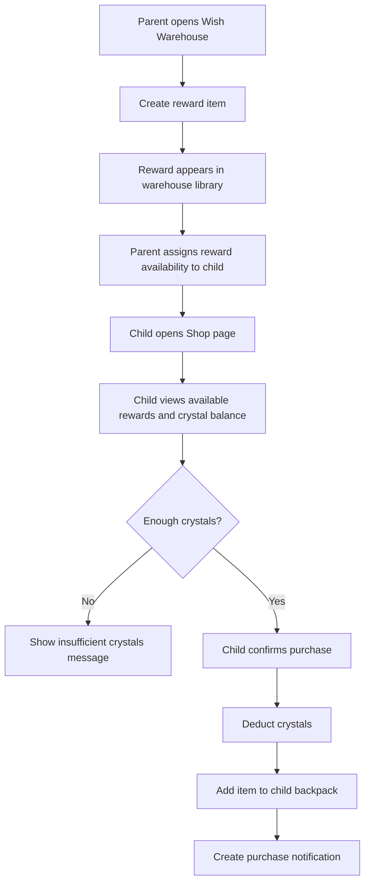

# FamilyJoy Shop Flow (Parent Warehouse and Child Shop)

```mermaid
flowchart TD
    A[Parent opens Wish Warehouse] --> B[Create reward item]
    B --> C[Reward appears in warehouse library]
    C --> D[Parent assigns reward availability to child]
    D --> E[Child opens Shop page]
    E --> F[Child views available rewards and crystal balance]
    F --> G{Enough crystals?}
    G -->|No| H[Show insufficient crystals message]
    G -->|Yes| I[Child confirms purchase]
    I --> J[Deduct crystals]
    J --> K[Add item to child backpack]
    K --> L[Create purchase notification]
```

## Notes
- Parent manages reward catalog and availability.
- Child purchase consumes crystals and moves item into backpack.
