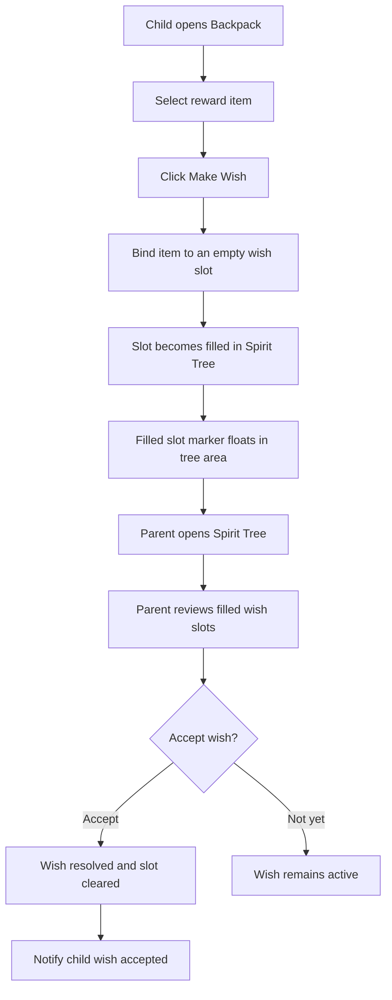

# FamilyJoy Spirit Tree and Backpack Flow

```mermaid
flowchart TD
    A[Child opens Backpack] --> B[Select reward item]
    B --> C[Click Make Wish]
    C --> D[Bind item to an empty wish slot]
    D --> E[Slot becomes filled in Spirit Tree]
    E --> F[Filled slot marker floats in tree area]
    F --> G[Parent opens Spirit Tree]
    G --> H[Parent reviews filled wish slots]
    H --> I{Accept wish?}
    I -->|Accept| J[Wish resolved and slot cleared]
    I -->|Not yet| K[Wish remains active]
    J --> L[Notify child wish accepted]
```

## Notes
- Empty slot actions guide child back to Backpack.
- Parent and child share the same slot contract and state mapping.
