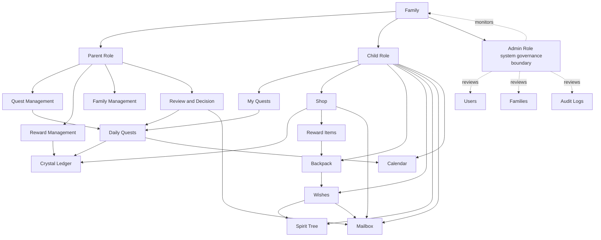

# FamilyJoy Problem Domain Sketch

## Notes
- `Family` is the top-level ownership boundary for most business data.
- `Parent` controls assignment, review, and reward management.
- `Child` interacts with quests, rewards, backpack items, wishes, and the spirit tree.
- `Admin` is outside the family workflow and focuses on operational governance.
