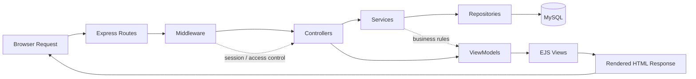

# FamilyJoy Main Runtime SSR Flow

## Notes
- The application follows an SSR request-response pattern rather than a SPA runtime.
- Middleware handles session and access checks before requests reach controllers.
- Controllers coordinate data from services and pass rendered data to EJS views through view models.
- MySQL is used as the persistent data store behind repository calls.
