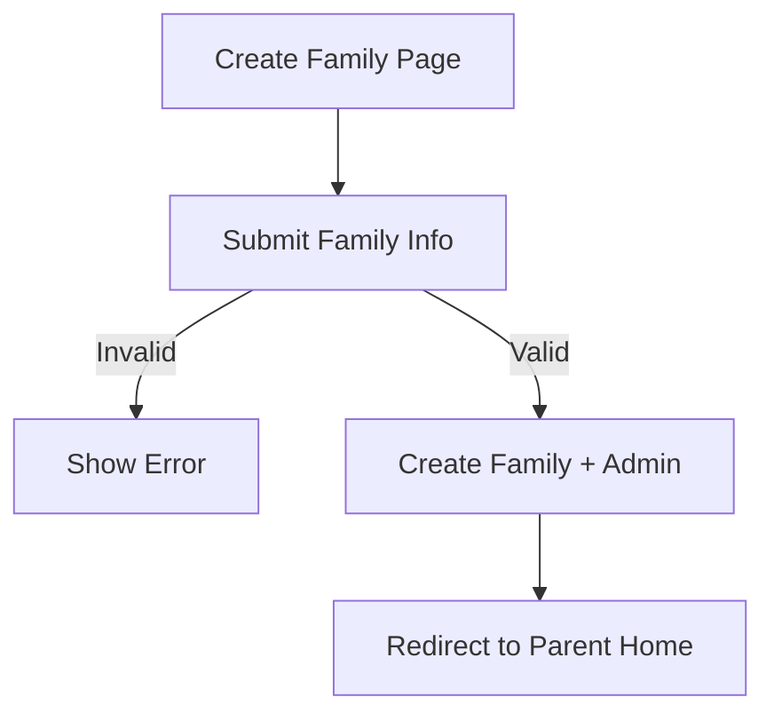

# Sprint 1 PRD - Family Creation System

## 1. Background / Problem
New families need a quick onboarding flow to create a family and initial parent account.

## 2. Goals & Non‑Goals
**Goals**
- Create a family with a 4-letter code.
- Create the initial parent account.

**Non‑Goals**
- Invite links or email verification.

## 3. Personas & Roles
- Parent (initial admin).

## 4. User Stories / Jobs
- As a parent, I can create my family and login immediately.

## 5. User Flow (Mermaid)

## 6. UI / Pages Map (Mermaid)

## 7. Functional Requirements
- Family name required.
- Family code: 4 letters.
- Admin username + password required.

## 8. Business Rules & Constraints
- Family code must be unique.
- Username is prefixed with family code.

## 9. Edge Cases / Errors
- Duplicate family code.
- Session save failure.

## 10. Metrics / Success Criteria
- Family creation completion rate.

## 11. Out of Scope
- Email verification.

## 12. Open Questions
- None.
