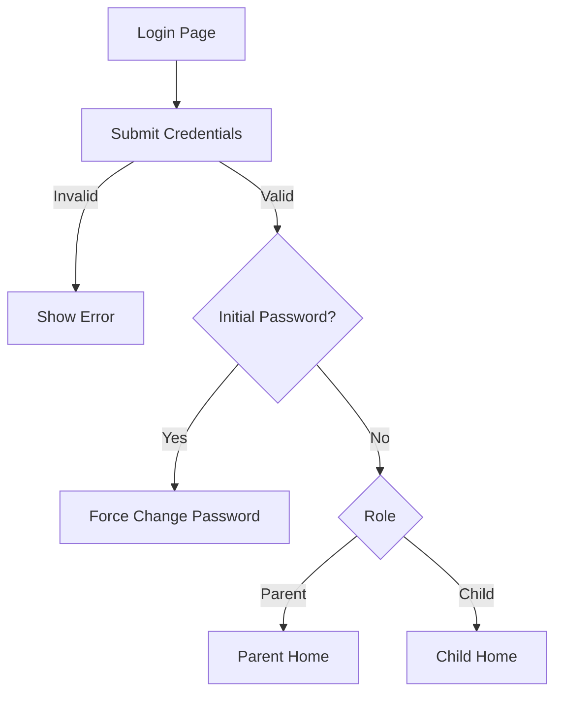
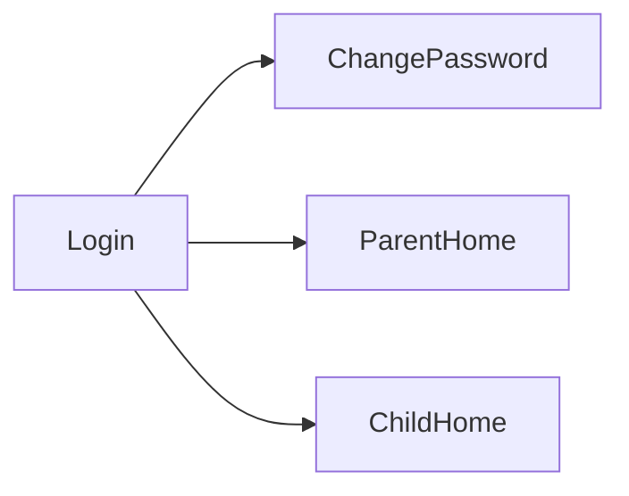

# Sprint 1 PRD - Login System

## 1. Background / Problem
Families need a secure, simple login entry point for both parents and children. Sprint 1 establishes the login experience and role-based routing.

## 2. Goals & Non‑Goals
**Goals**
- Allow users to login with family code + username format.
- Enforce initial password change on first login.
- Route users based on role.

**Non‑Goals**
- Social login or MFA.
- Password recovery flow.

## 3. Personas & Roles
- Parent: manages family and quests.
- Child: completes quests.

## 4. User Stories / Jobs
- As a user, I can login with my username and password.
- As a first-time user, I must change password before proceeding.

## 5. User Flow (Mermaid)

## 6. UI / Pages Map (Mermaid)

## 7. Functional Requirements
- Username format: CODE_username.
- Remember me (30 days) optional.
- Validation errors shown on login page.

## 8. Business Rules & Constraints
- Session-based authentication.
- Initial password requires change.

## 9. Edge Cases / Errors
- Invalid username/password.
- Disabled account.
- Session storage failure.

## 10. Metrics / Success Criteria
- Successful login rate.
- Password change completion rate.

## 11. Out of Scope
- Password reset via email.
- MFA.

## 12. Open Questions
- None.
