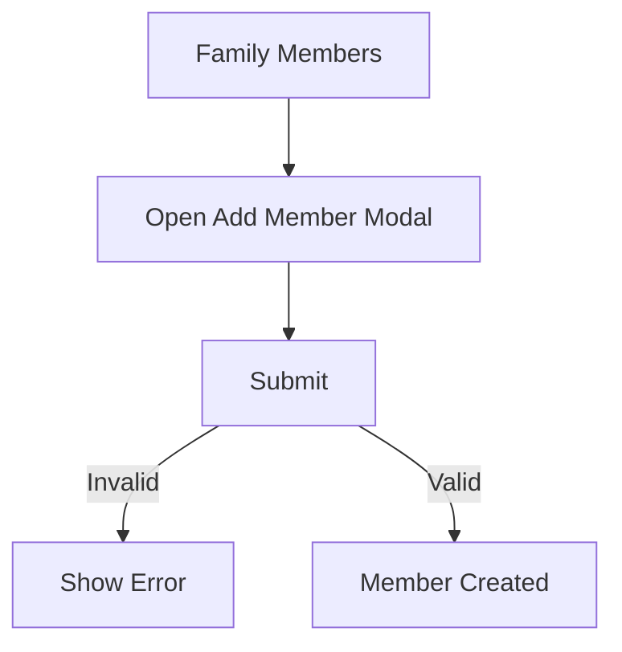
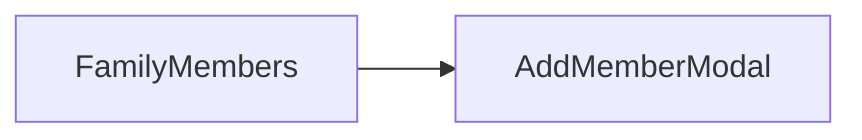

# Sprint 1 PRD - Member Account Generation

## 1. Background / Problem
Parents need to create accounts for other family members.

## 2. Goals & Non‑Goals
**Goals**
- Allow admins to add parent/child members.
- Provide a default login password (family code).

**Non‑Goals**
- Self-registration.

## 3. Personas & Roles
- Parent admin

## 4. User Stories / Jobs
- As an admin, I can add a child or parent account.

## 5. User Flow (Mermaid)

## 6. UI / Pages Map (Mermaid)

## 7. Functional Requirements
- Username required (suffix only, prefix auto).
- Role selection: parent or child.

## 8. Business Rules & Constraints
- Admin-only access.
- Username must be unique.

## 9. Edge Cases / Errors
- Duplicate username.

## 10. Metrics / Success Criteria
- Member creation success rate.

## 11. Out of Scope
- Email invitations.

## 12. Open Questions
- None.
