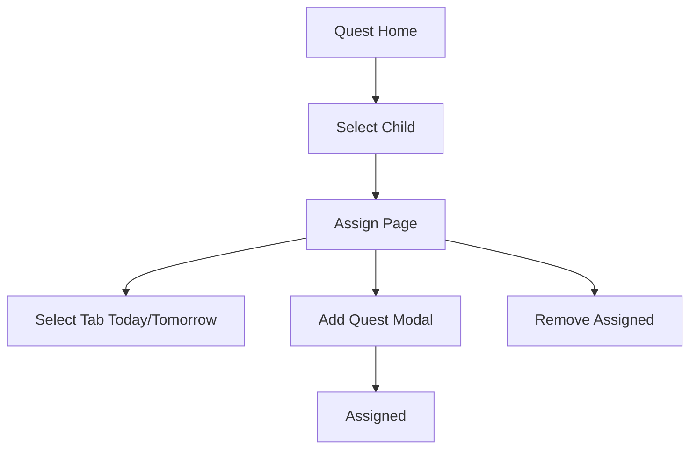

# Sprint 2 PRD - Daily Quest Assignment

## 1. Background / Problem
Parents need to assign quests to children for Today and Tomorrow only.

## 2. Goals & Non‑Goals
**Goals**
- Assign quests from Quest Book to a child for Today or Tomorrow.
- Remove assigned quests.

**Non‑Goals**
- Multi-day scheduling beyond Tomorrow.
- Rewards.

## 3. Personas & Roles
- Parent

## 4. User Stories / Jobs
- As a parent, I can assign quests for Today or Tomorrow.

## 5. User Flow (Mermaid)

## 6. UI / Pages Map (Mermaid)

## 7. Functional Requirements
- Tab-based view for Today and Tomorrow.
- Add Quest button appears only with active child.
- Day is derived from active tab (hidden field).

## 8. Business Rules & Constraints
- Duplicate assignment is blocked.
- Only `assigned` status can be removed.

## 9. Edge Cases / Errors
- No active child: show message.

## 10. Metrics / Success Criteria
- Assignment success rate.

## 11. Out of Scope
- Future scheduling beyond Tomorrow.

## 12. Open Questions
- None.
