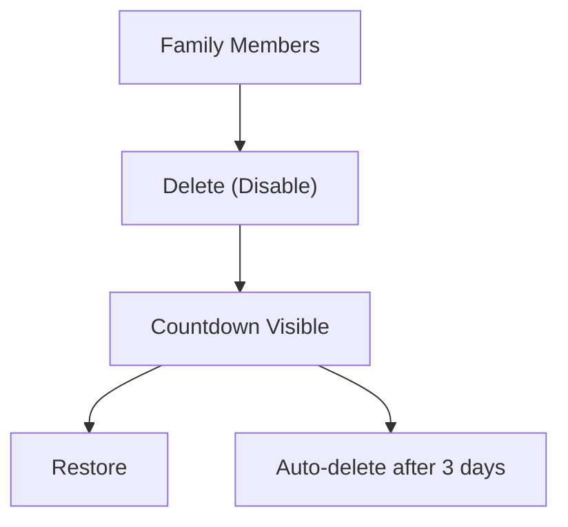
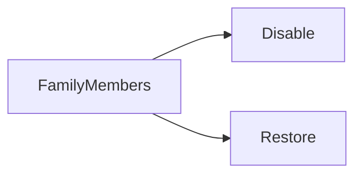

# Sprint 2 PRD - Family Member Disable and Delete

## 1. Background / Problem
Admins need to disable a family member with a delayed delete window for safety.

## 2. Goals & Non‑Goals
**Goals**
- Disable member with 7-day countdown.
- Restore within countdown.

**Non‑Goals**
- Immediate hard delete.

## 3. Personas & Roles
- Parent admin

## 4. User Stories / Jobs
- As an admin, I can disable and restore members.

## 5. User Flow (Mermaid)

## 6. UI / Pages Map (Mermaid)

## 7. Functional Requirements
- Countdown text shown when disabled.
- Do not show "disabled" badge during countdown.

## 8. Business Rules & Constraints
- Only admin can disable/restore.

## 9. Edge Cases / Errors
- Missing member ID.

## 10. Metrics / Success Criteria
- Restore success rate.

## 11. Out of Scope
- Recovery after deletion.

## 12. Open Questions
- None.
