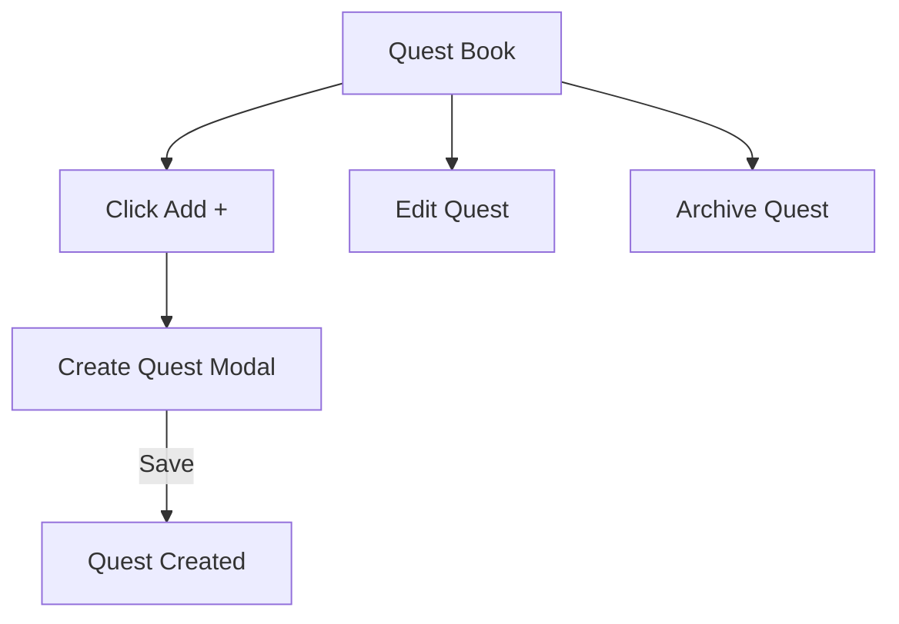

# Sprint 2 PRD - Quest Book System

## 1. Background / Problem
Parents need a reusable quest library to assign daily quests efficiently.

## 2. Goals & Non‑Goals
**Goals**
- Create and manage quest definitions by category.
- Archive old quests.

**Non‑Goals**
- Rewards or icons.
- Bulk import.

## 3. Personas & Roles
- Parent admin

## 4. User Stories / Jobs
- As a parent, I can create and organize quests by category.

## 5. User Flow (Mermaid)

## 6. UI / Pages Map (Mermaid)

## 7. Functional Requirements
- Category sections with per-category Add button.
- Create modal shows category text and submits hidden category.
- Edit modal updates name/description/category.
- Archive action available per quest.

## 8. Business Rules & Constraints
- Archived quests are not available for new assignments.

## 9. Edge Cases / Errors
- Empty state message when no definitions.

## 10. Metrics / Success Criteria
- Quest definition creation success rate.

## 11. Out of Scope
- Rewards and icons.

## 12. Open Questions
- None.
