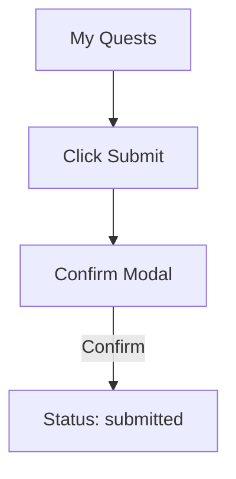
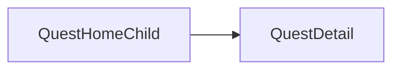

# Sprint 2 PRD - Quest Completion Submission

## 1. Background / Problem
Children need to submit completed quests and have them reviewed by parents.

## 2. Goals & Non‑Goals
**Goals**
- Submit Today quests.
- Provide confirmation before submission.

**Non‑Goals**
- Resubmission or undo.

## 3. Personas & Roles
- Child

## 4. User Stories / Jobs
- As a child, I can submit my assigned quest for Today.

## 5. User Flow (Mermaid)

## 6. UI / Pages Map (Mermaid)

## 7. Functional Requirements
- Submit button shown only for Today and `assigned` status.
- Use Bootstrap modal confirmation.

## 8. Business Rules & Constraints
- Only Today quests can be submitted.

## 9. Edge Cases / Errors
- Attempt to submit Tomorrow quest should be blocked.

## 10. Metrics / Success Criteria
- Submission success rate.

## 11. Out of Scope
- Rewards.

## 12. Open Questions
- None.
