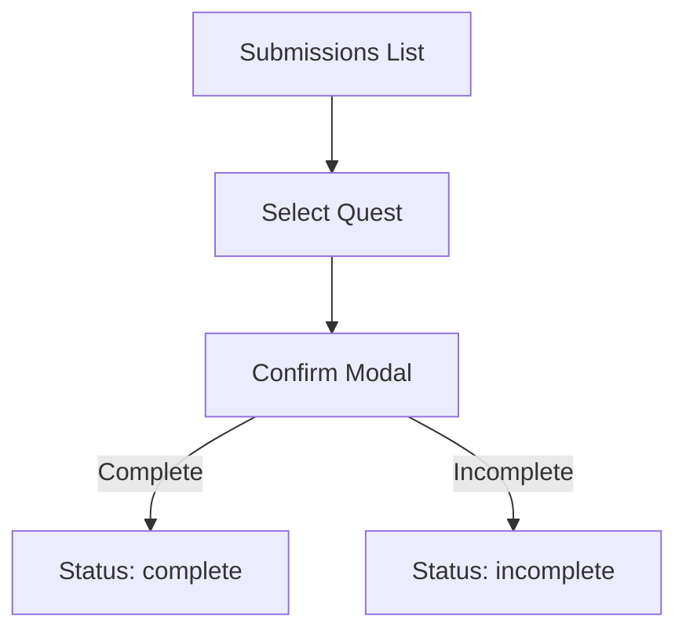
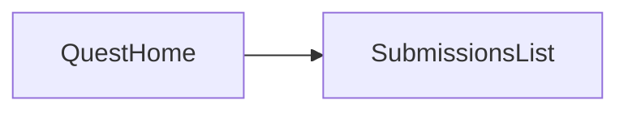

# Sprint 2 PRD - Quest Review

## 1. Background / Problem
Parents need to review child submissions and confirm completion.

## 2. Goals & Non‑Goals
**Goals**
- Review submitted quests by child.
- Mark as complete or incomplete.

**Non‑Goals**
- Comments or attachments.

## 3. Personas & Roles
- Parent

## 4. User Stories / Jobs
- As a parent, I can review and confirm submissions.

## 5. User Flow (Mermaid)

## 6. UI / Pages Map (Mermaid)

## 7. Functional Requirements
- Group by child.
- Icon buttons for complete/incomplete.

## 8. Business Rules & Constraints
- Only `submitted` quests appear.

## 9. Edge Cases / Errors
- Empty submissions list.

## 10. Metrics / Success Criteria
- Review completion time.

## 11. Out of Scope
- Rewards.

## 12. Open Questions
- None.
