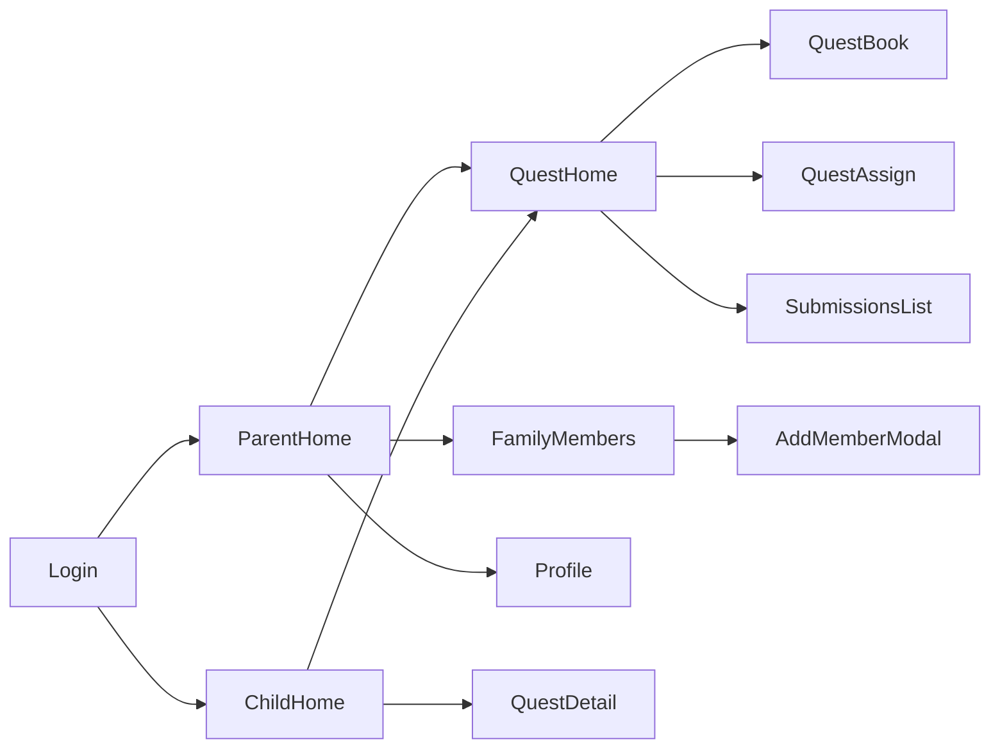

# Sprint 2 PRD - UI Page Tree

## 1. Overview
Sprint 2 introduces Quest management and delayed delete for family members.

## 2. Page Tree (Mermaid)

## 3. Out of Scope
- Rewards flow
- Notifications
