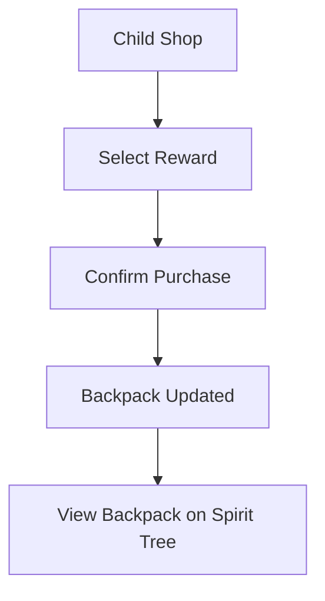
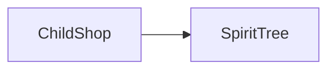

# Sprint 3 PRD - Child Shop and Backpack

## 1. Background / Problem
Children need a simple way to spend crystals and see what they own.

## 2. Goals & Non-Goals
**Goals**
- Browse available rewards.
- Purchase rewards into a backpack.
- Display backpack on the Spirit Tree (Child Home) page.

**Non-Goals**
- Wish Tree slots and request submission.
- Reward usage workflows.

## 3. Personas & Roles
- Child

## 4. User Stories / Jobs
- As a child, I can buy a reward with crystals.
- As a child, I can see my owned rewards in a backpack.

## 5. User Flow (Mermaid)

## 6. UI / Pages Map (Mermaid)

## 7. Functional Requirements
- Show all rewards assigned to the child, including inactive or out-of-stock items.
- Purchase deducts crystals immediately.
- Purchase requires a confirmation modal.
- Backpack items are grouped by item type. Same items stack with count display (minimum shown is x1).
- Spirit Tree shows a horizontal row of 5 backpack slots with the top 5 items by quantity.
- If quantities are tied, sort by item name (A–Z).
- Tapping the backpack opens a modal with a 5x5 grid.
- The modal has left and right arrows to switch pages.
- The right arrow is enabled only when there are more than 25 item types.
- The left arrow is enabled only when not on the first page.
- The modal shows current page and total pages at the bottom.
- Total pages are dynamic based on item-type count, with a minimum grid capacity of 5x5.
- Backpack modal sorting follows the same rule as the top-5 view (quantity desc, name asc).
- Child Shop does not include a shortcut link back to Spirit Tree.

## 8. Business Rules & Constraints
- Purchase blocked if balance is insufficient.
- Backpack is per child.
- If a reward is inactive or its assigned quantity is 0, it is shown in grey and cannot be purchased.
- When a purchase succeeds, the assigned quantity for that child decreases by 1.

## 9. Edge Cases / Errors
- Attempt to buy a deactivated reward should be blocked.
- When balance is insufficient, show a floating toast message: "Insufficient balance".
- When assigned quantity is 0, show count as x0 and disable purchase.
- Pagination total is based on the number of owned item types in the backpack (purchased items only). Total pages = ceil(itemTypeCount / 25). If itemTypeCount > 25, enable the right arrow.

## 10. Metrics / Success Criteria
- Purchase success rate.

## 11. Out of Scope
- Reward consumption or wish submission.

## 12. Open Questions
- None.
