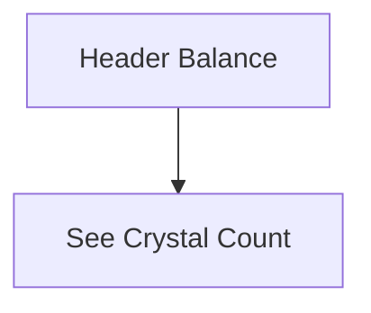

# Sprint 3 PRD - Crystal Wallet (UI) and Ledger (DB Only)

## 1. Background / Problem
Users need visibility into their crystal balance and transaction history to understand earnings and spending.

## 2. Goals & Non-Goals
**Goals**
- Show crystal balance for all roles.
- Record crystal transactions in the database for future inbox/ledger use.
- Reserve a placeholder for a second currency named **Essence** (no logic in Sprint 3).

**Non-Goals**
- Any ledger UI in Sprint 3.
- Advanced analytics or filters.
- Exporting ledger data.

## 3. Personas & Roles
- Parent
- Child

## 4. User Stories / Jobs
- As a user, I can see my crystal balance.
- As the system, I can record crystal transactions for later notification.

## 5. User Flow (Mermaid)

## 6. UI / Pages Map (Mermaid)

## 7. Functional Requirements
- Balance displayed at the top-center header location reserved for currency (child only).
- Crystal transactions are recorded in the database (no UI).
- Use a single balance field named `crystal_balance`.
- Essence is a future currency for the Spirit Tree system. It is shown as a placeholder only (no balance logic).
- Ledger records include transaction type (earn/spend) and source reference.

## 8. Business Rules & Constraints
- Ledger is append-only (DB only).
- Add a `crystal_ledger` table for transaction records.
- Required ledger types in Sprint 3 include `quest_reward` (earn) and `purchase` (spend).

## 9. Edge Cases / Errors
- If balance is missing, default to 0 in UI.

## 10. Metrics / Success Criteria
- Wallet view load success rate.

## 11. Out of Scope
- Multi-currency support.

## 12. Open Questions
- Ledger UI and inbox notifications will be defined in a later sprint.
