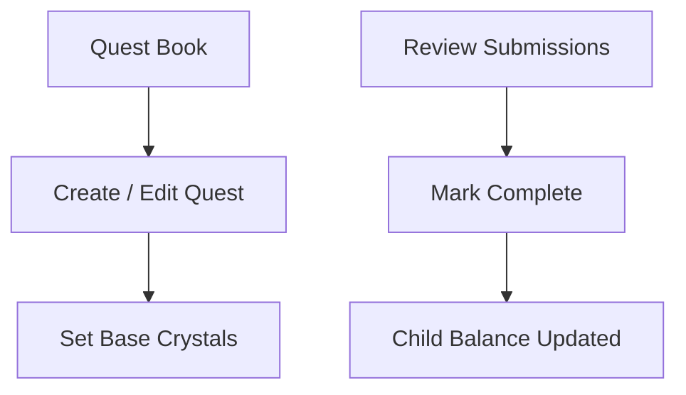

# Sprint 3 PRD - Quest Rewards (Base Crystals)

## 1. Background / Problem
Quest completion currently ends at status change only. We need base crystals per quest and reward issuance on parent confirmation to enable the economy loop.

## 2. Goals & Non-Goals
**Goals**
- Allow parents to set base crystals per quest definition.
- Issue crystals to the child when a quest is marked complete.
- Record reward issuance in the crystal ledger.

**Non-Goals**
- Bonus multipliers, streaks, or ratings.
- Auto-reward without parent confirmation.

## 3. Personas & Roles
- Parent
- Child

## 4. User Stories / Jobs
- As a parent, I can set base crystals for a quest.
- As a parent, I can confirm completion and the child receives crystals.

## 5. User Flow (Mermaid)

## 6. UI / Pages Map (Mermaid)

## 7. Functional Requirements
- Quest Book form includes base crystals input.
- Base crystals stored per quest definition.
- Marking a quest as complete adds crystals to child balance.
- Marking incomplete does not add crystals.
- Ledger entry is created for each reward issuance (DB only; no UI in Sprint 3).
- Once a child submits a quest or a parent confirms it, the quest status is immutable.

## 8. Business Rules & Constraints
- Rewards are issued only on parent confirmation.
- Base crystals must be a non-negative integer.
- Currency is a single unit named **crystal**.
- Prevent duplicate reward issuance if a quest is already marked `complete`.
- Reward issuance occurs only on the first transition to `complete`.
- `incomplete` is a terminal state and cannot be changed once set.

## 9. Edge Cases / Errors
- Quest already completed should not double-issue rewards.
- Invalid base crystal input should be rejected.

## 10. Metrics / Success Criteria
- Reward issuance success rate.

## 11. Out of Scope
- Reward caps or daily limits.

## 12. Open Questions
- None.
