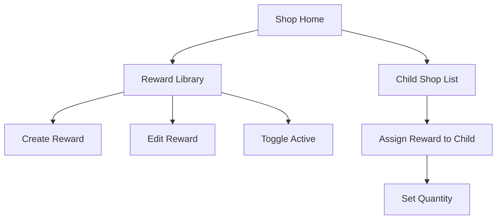
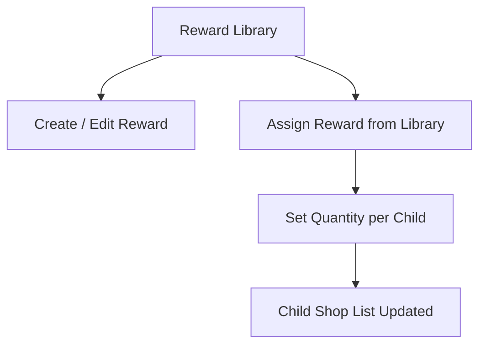
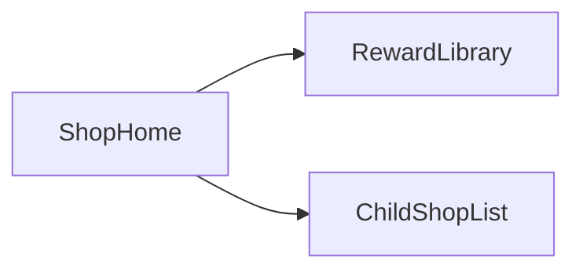

# Sprint 3 PRD - Parent Reward Shop Management

## 1. Background / Problem
Parents need a way to define rewards that children can purchase with crystals.

## 2. Goals & Non-Goals
**Goals**
- Create rewards with name and price.
- Add a simple description (default when empty).
- Select a reward icon from a fixed set (10 options).
- Activate or deactivate rewards.
- Limit visibility to selected children.

**Non-Goals**
- Inventory limits.
- Reward images or categories.
- Custom icon upload (planned for later).

## 3. Personas & Roles
- Parent (Family Admin)

## 4. User Stories / Jobs
- As a parent, I can create a reward and set its price.
- As a parent, I can control which children see a reward.
- As a parent, I can activate or deactivate a reward.

## 5. User Flow (Mermaid)

## 5.1 Parent Reward Library → Child Shop Assignment (Mermaid)

## 6. UI / Pages Map (Mermaid)

## 7. Functional Requirements
- Create reward with name, price, optional description, and icon.
- Provide a choice of 10 predefined reward icons mapped to child life items.
- Default description is "Magic Gift". The input is prefilled on the front end and can be edited.
- Empty strings are not allowed; if the user does not change the default, it is submitted as-is.
- Activate and deactivate reward.
- Select visible children per reward (per-child visibility list) and set quantity per child.
- Parent list view shows status, price, and icon.
- Parent can edit per-child quantity via a modal from the child assignment list.
- Shop home provides entry to Reward Library and per-child shop lists.

## 8. Business Rules & Constraints
- Deactivated rewards are shown as disabled (grey) in the child shop.
- Quantity is per child. Inventory can be set to 0.
- Price changes affect future purchases only.
- Unlisting does not remove items already owned.
- Parent maintains a master reward list, then assigns visibility per child.
- Price must be a positive integer (no zero-price rewards).
- Price maximum: 9999.
- Reward name max length: 50 characters.
- Reward description max length: 120 characters.
- Quantity per child must be an integer >= 0.
- Icon options (fixed list of 10): `gift`, `book`, `game`, `sports`, `snack`, `outdoor`, `music`, `art`, `pet`, `star`.

## 9. Edge Cases / Errors
- Invalid price input should be rejected.
- Invalid quantity input should be rejected.

## 10. Metrics / Success Criteria
- Reward creation success rate.

## 11. Out of Scope
- Reward usage and fulfillment workflows.
- Icon upload or photo capture.

## 12. Open Questions
- None.
