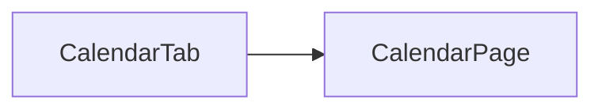

# Sprint 4 PRD - Calendar

## 1. Background / Problem
Families need a visual, day-based view of quest completion to build consistent habits.

## 2. Goals & Non-Goals
**Goals**
- Provide a monthly calendar view for both parent and child.
- Show daily completion percentage in each date cell.
- Show per-day quest details in a lower detail panel.

**Non-Goals**
- Custom date range selection.
- Year view or week view.

## 3. Personas & Roles
- Parent
- Child

## 4. User Stories / Jobs
- As a child, I can view my monthly completion calendar.
- As a parent, I can view overall family completion on the calendar and drill into each child.

## 5. User Flow (Mermaid)
```mermaid
flowchart TD
  A[Bottom Nav: Calendar] --> B[Monthly Calendar]
  B --> C[Select a Date]
  C --> D[Detail Panel]
  D --> E[Switch Child Tab (Parent)]
```

## 6. UI / Pages Map (Mermaid)


## 7. Functional Requirements
- Add a new bottom nav entry: **Calendar**.
- Bottom nav order:
  - Parent: Calendar, Quest, Home, Shop, Family
  - Child: Calendar, Quest, Spirit Tree, Shop
- Calendar shows the current month by default, with previous/next month navigation.
- Day-of-week is displayed in a header row above the grid.
- Each date cell shows date number and completion percentage on the same line (date larger, percentage smaller).
- Default selected date is **today**.
- Lower detail panel shows quest details for the selected date.
- Parent calendar displays **average completion across all children** in the calendar grid.
- Parent detail panel uses tabs to switch between children.
 - Calendar supports **Prev / Today / Next** navigation for month switching.

## 8. Business Rules & Constraints
- Completion rate = completed quests / total quests for that date.
- If total quests = 0, show 0%.
- Time basis uses **server time**.
- Completed quests are those confirmed by parent as `complete`.
- Total quests are all quests assigned to the child for that date.
- Parent calendar percentage = (total completed quests for all children) / (total assigned quests for all children).
- Cross-month date cells are shown in grey and are not selectable for detail view.

## 9. Detail Panel Fields
- Quest name
- Status
- Completion rate (for selected date)
- Crystals earned

## 10. Edge Cases / Errors
- Dates with no tasks show an empty state in detail panel.

## 11. Metrics / Success Criteria
- Calendar page load success rate.

## 12. Open Questions
- None.
