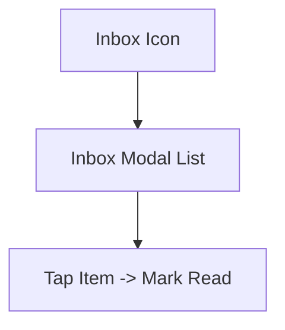
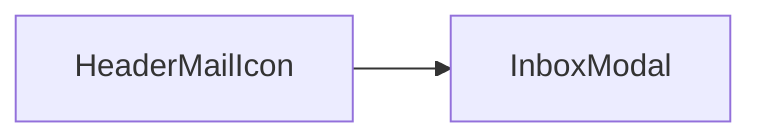

# Sprint 4 PRD - Notifications (Crystal Only)

## 1. Background / Problem
Users need a lightweight record of crystal-related events and quest review outcomes.

## 2. Goals & Non-Goals
**Goals**
- Provide an inbox list of crystal gain/spend events and quest review outcomes.
- Show time, event, and amount when relevant.
- Support read/unread state with a visible badge.

**Non-Goals**
- Push notifications.
- Other system message types beyond crystal events and quest review outcomes.

## 3. Personas & Roles
- Parent
- Child

## 4. User Stories / Jobs
- As a user, I can view a list of notifications in a modal inbox.
- As a user, I can tell which messages are unread and tap to mark them read.

## 5. User Flow (Mermaid)

## 6. UI / Pages Map (Mermaid)

## 7. Functional Requirements
- Record notifications for:
  - Crystal earned (quest completion)
  - Crystal spent (reward purchase)
  - Quest marked incomplete by parent
- Each entry includes: time and event; amount when applicable.
- Entries are ordered by time (newest first).
- Mail icon shows a red dot when there are unread messages.
- Each message item is clickable:
  - Unread shows a small `NEW` badge.
  - Read shows no badge.
  - Tapping an unread item marks it as read.

## 8. Business Rules & Constraints
- Notifications are created only on successful earn/spend events.
- Message types limited to crystal events and quest review outcomes.
- De-duplication: only one notification per successful event (quest completion or purchase).

## 9. Message Format (Suggested)
- **Title**: `Quest Completed` / `Reward Purchased` / `Quest Failed`
- **Body**:
  - `You earned {amount} crystals from "{questName}".`
  - `You spent {amount} crystals on "{rewardName}".`
  - `Your quest "{questName}" was marked incomplete.`
- **Meta**: `{YYYY-MM-DD HH:mm}` timestamp shown below the body.

## 10. Edge Cases / Errors
- Empty inbox shows an empty state.

## 11. Metrics / Success Criteria
- Inbox view load success rate.

## 12. Out of Scope
- Push/system-level notifications outside the inbox modal.

## 13. Open Questions
- None.
