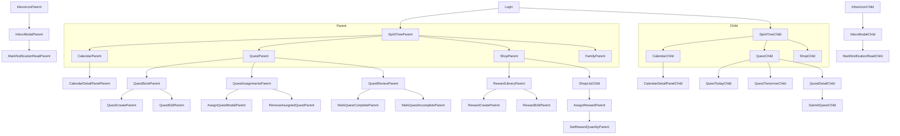

# Sprint 4 PRD - UI Tree

## 1. UI Tree (Sprint 4)

```mermaid
flowchart TD
  Login --> SpiritTreeParent
  Login --> SpiritTreeChild

  %% Parent-visible navigation
  subgraph Parent
    SpiritTreeParent --> CalendarParent
    SpiritTreeParent --> QuestParent
    SpiritTreeParent --> ShopParent
    SpiritTreeParent --> FamilyParent
  end

  %% Child-visible navigation
  subgraph Child
    SpiritTreeChild --> CalendarChild
    SpiritTreeChild --> QuestChild
    SpiritTreeChild --> ShopChild
  end

  %% Calendar
  CalendarParent --> CalendarDetailPanelParent
  CalendarChild --> CalendarDetailPanelChild

  %% Parent quests
  QuestParent --> QuestBookParent
  QuestParent --> QuestAssignmentsParent
  QuestParent --> QuestReviewParent
  QuestBookParent --> QuestCreateParent
  QuestBookParent --> QuestEditParent
  QuestAssignmentsParent --> AssignQuestModalParent
  QuestAssignmentsParent --> RemoveAssignedQuestParent
  QuestReviewParent --> MarkQuestCompleteParent
  QuestReviewParent --> MarkQuestIncompleteParent

  %% Child quests
  QuestChild --> QuestTodayChild
  QuestChild --> QuestTomorrowChild
  QuestChild --> QuestDetailChild
  QuestDetailChild --> SubmitQuestChild

  %% Notifications
  InboxIconParent --> InboxModalParent
  InboxIconChild --> InboxModalChild
  InboxModalParent --> MarkNotificationReadParent
  InboxModalChild --> MarkNotificationReadChild

  %% Reward icons (Shop)
  ShopParent --> RewardLibraryParent
  ShopParent --> ShopListChild
  RewardLibraryParent --> RewardCreateParent
  RewardLibraryParent --> RewardEditParent
  ShopListChild --> AssignRewardParent
  AssignRewardParent --> SetRewardQuantityParent
```
