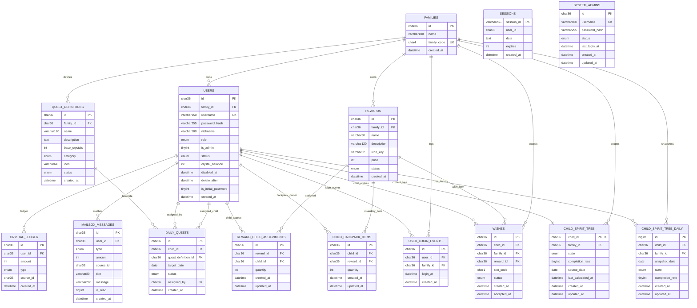

# FamilyJoy Database Table Structure

**Source schema:** `familyjoy_db.sql`  
**Purpose:** Describe the current database table structure and visualize table relationships using Mermaid.  
**Data included:** No. This document describes schema only.

---

## 1. Schema Overview

The FamilyJoy database supports the following major domains:
- Family and account management
- Session and login tracking
- Quest definition and daily quest lifecycle
- Reward catalog, assignment, and child inventory
- Wish and spirit tree interactions
- Mailbox notifications
- System admin access

Current table set:
- `families`
- `users`
- `sessions`
- `system_admins`
- `user_login_events`
- `quest_definitions`
- `daily_quests`
- `crystal_ledger`
- `rewards`
- `reward_child_assignments`
- `child_backpack_items`
- `wishes`
- `child_spirit_tree`
- `child_spirit_tree_daily`
- `mailbox_messages`

---

## 2. Table Descriptions

### 2.1 `families`
Purpose:
Stores the family unit as the top-level ownership boundary for most business data.

Key fields:
- `id`: primary key
- `name`: family display name
- `family_code`: unique family join or identification code
- `created_at`: creation timestamp

Relationships:
- One family has many users
- One family has many quest definitions
- One family has many rewards
- One family has many wishes
- One family has many spirit-tree records
- One family has many login event records

### 2.2 `users`
Purpose:
Stores family member accounts for parent and child roles.

Key fields:
- `id`: primary key
- `family_id`: owning family
- `username`: unique login name
- `password_hash`: credential hash
- `nickname`: display name
- `role`: `parent` or `child`
- `is_admin`: family admin flag inside the main application
- `status`: `active` or `disabled`
- `crystal_balance`: current reward balance
- `is_initial_password`: indicates forced password change state

Relationships:
- Many users belong to one family
- One user can be assigned many daily quests
- One child user can receive many rewards, backpack items, wishes, mailbox messages, and spirit-tree records
- One user can generate many login events and ledger rows

### 2.3 `sessions`
Purpose:
Stores active application sessions for SSR login state management.

Key fields:
- `session_id`: primary key
- `user_id`: optional mapped user id
- `data`: serialized session payload
- `expires`: expiration timestamp in integer form
- `created_at`: session creation timestamp

Relationships:
- Logical relationship to users through `user_id`
- No foreign key is currently enforced in the dump

### 2.4 `system_admins`
Purpose:
Stores dedicated system-level admin accounts for the separate admin portal.

Key fields:
- `id`: primary key
- `username`: unique admin login name
- `password_hash`: admin credential hash
- `status`: `active` or `disabled`
- `last_login_at`: latest login timestamp
- `created_at`, `updated_at`: audit timestamps

Relationships:
- Standalone admin identity table
- Not family-scoped

### 2.5 `user_login_events`
Purpose:
Stores login tracking events for operational monitoring and analytics.

Key fields:
- `id`: primary key
- `user_id`: login actor
- `family_id`: family context
- `login_at`: login timestamp
- `created_at`: row creation timestamp

Relationships:
- Many login events belong to one user
- Many login events belong to one family

### 2.6 `quest_definitions`
Purpose:
Stores reusable quest templates created at family level.

Key fields:
- `id`: primary key
- `family_id`: owning family
- `name`: quest title
- `description`: quest details
- `base_crystals`: reward amount
- `category`: quest type classification
- `icon`: optional icon reference
- `status`: `active` or `archived`
- `created_at`: creation timestamp

Relationships:
- Many quest definitions belong to one family
- One quest definition can produce many daily quest assignments

### 2.7 `daily_quests`
Purpose:
Stores date-specific quest assignments and status progression for children.

Key fields:
- `id`: primary key
- `child_id`: assigned child user
- `quest_definition_id`: source template
- `target_date`: assigned day
- `status`: `assigned`, `submitted`, `complete`, or `incomplete`
- `assigned_by`: assigning parent user
- `created_at`: assignment timestamp

Relationships:
- Many daily quests belong to one child user
- Many daily quests reference one quest definition
- Many daily quests are created by one parent user

### 2.8 `crystal_ledger`
Purpose:
Stores balance-changing reward and purchase transactions.

Key fields:
- `id`: primary key
- `user_id`: affected user
- `amount`: signed transaction amount
- `type`: `quest_reward` or `purchase`
- `source_id`: optional related business record
- `created_at`: transaction timestamp

Relationships:
- Many ledger entries belong to one user

### 2.9 `rewards`
Purpose:
Stores family-owned reward catalog items.

Key fields:
- `id`: primary key
- `family_id`: owning family
- `name`: reward name
- `description`: reward description
- `icon_key`: icon identifier
- `price`: crystal cost
- `status`: `active` or `inactive`
- `created_at`: creation timestamp

Relationships:
- Many rewards belong to one family
- One reward can be assigned to many children
- One reward can appear in many backpack rows
- One reward can be referenced by many wishes

### 2.10 `reward_child_assignments`
Purpose:
Stores which rewards are available to which child and in what quantity.

Key fields:
- `id`: primary key
- `reward_id`: assigned reward
- `child_id`: target child
- `quantity`: available quantity
- `created_at`, `updated_at`: timestamps

Relationships:
- Many assignment rows reference one reward
- Many assignment rows reference one child user

### 2.11 `child_backpack_items`
Purpose:
Stores purchased or owned child inventory items.

Key fields:
- `id`: primary key
- `child_id`: owner child
- `reward_id`: linked reward item
- `quantity`: inventory quantity
- `created_at`, `updated_at`: timestamps

Relationships:
- Many backpack rows belong to one child user
- Many backpack rows reference one reward

### 2.12 `wishes`
Purpose:
Stores wishes created from reward items and bound to spirit-tree slots.

Key fields:
- `id`: primary key
- `child_id`: requesting child
- `family_id`: family context
- `reward_id`: wished reward item
- `slot_code`: wish slot identifier
- `status`: `open` or `accepted`
- `created_at`: creation timestamp
- `accepted_at`: completion timestamp

Relationships:
- Many wishes belong to one child
- Many wishes belong to one family
- Many wishes reference one reward

### 2.13 `child_spirit_tree`
Purpose:
Stores the current spirit-tree status snapshot for each child.

Key fields:
- `child_id`: primary key and child reference
- `family_id`: family context
- `state`: `withered`, `sicked`, or `healthy`
- `completion_rate`: current completion percentage
- `source_date`: source date of the latest calculation
- `last_calculated_at`: latest refresh timestamp
- `created_at`, `updated_at`: timestamps

Relationships:
- One record belongs to one child
- One record belongs to one family

### 2.14 `child_spirit_tree_daily`
Purpose:
Stores daily historical snapshots of spirit-tree state.

Key fields:
- `id`: primary key
- `child_id`: child reference
- `family_id`: family context
- `snapshot_date`: snapshot date
- `state`: tree state on that date
- `completion_rate`: completion percentage on that date
- `created_at`, `updated_at`: timestamps

Relationships:
- Many daily snapshots belong to one child
- Many daily snapshots belong to one family

### 2.15 `mailbox_messages`
Purpose:
Stores notification messages shown to users.

Key fields:
- `id`: primary key
- `user_id`: target user
- `type`: mailbox event type
- `amount`: numeric payload for reward/spend related messages
- `source_id`: optional related record id
- `title`: message title
- `message`: message body
- `is_read`: read state
- `created_at`: creation timestamp

Relationships:
- Many mailbox messages belong to one user

---

## 3. Relationship Summary

Core ownership chain:
- `families` -> `users`
- `families` -> `quest_definitions`
- `families` -> `rewards`

Quest lifecycle chain:
- `quest_definitions` -> `daily_quests`
- `users` -> `daily_quests` as both child and assigning parent
- `users` -> `crystal_ledger`

Reward and wish chain:
- `rewards` -> `reward_child_assignments`
- `rewards` -> `child_backpack_items`
- `rewards` -> `wishes`
- `users` -> `child_backpack_items`
- `users` -> `wishes`

Spirit tree and history chain:
- `users` -> `child_spirit_tree`
- `users` -> `child_spirit_tree_daily`
- `families` -> `child_spirit_tree`
- `families` -> `child_spirit_tree_daily`

Operational tracking chain:
- `users` -> `mailbox_messages`
- `users` -> `user_login_events`
- `families` -> `user_login_events`
- `system_admins` remains separate from family-scoped business data

---

## 4. Mermaid ER Diagram

---

## 5. Notes

- `sessions` is logically linked to `users`, but the current dump does not define a foreign key.
- `system_admins` is isolated from the family-scoped application model and is used for the separate admin portal.
- `user_login_events` expands the schema beyond the earlier simplified structure and should be treated as part of the current operational model.
- Some source SQL comments may still contain encoding artifacts; this document normalizes the table descriptions into English.
