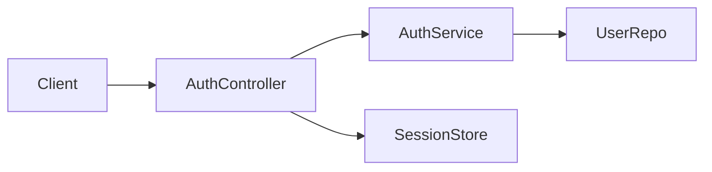
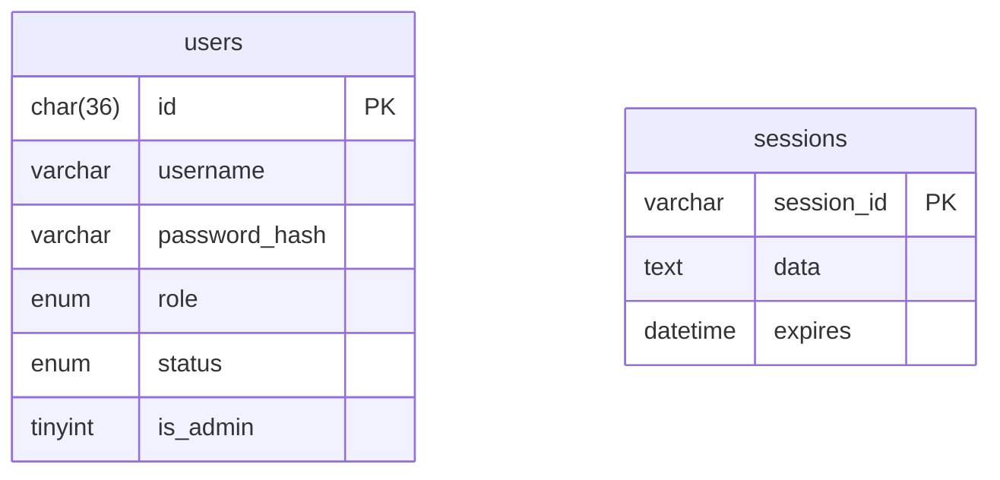
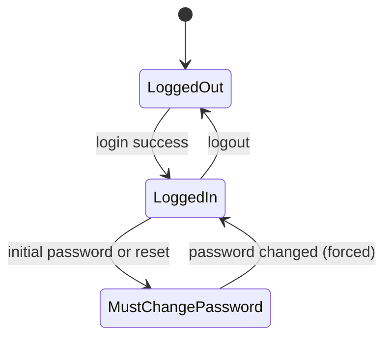
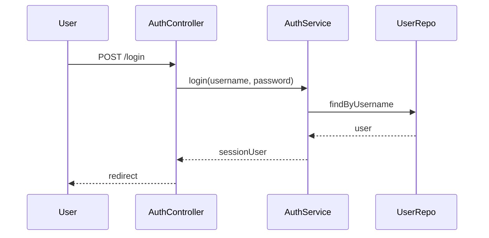

# Sprint 1 TDD - Auth and Session Management

## 1. Overview & Scope
Implements session-based authentication, login validation, and role-based redirects.

## 2. Architecture (Mermaid)

## 3. Module Responsibilities
- AuthController: request handling and redirects.
- AuthService: login validation and session user creation.
- UserRepo: DB access.
- SessionStore: MySQL-backed sessions.

## 4. Data Model / ERD (Mermaid)

## 5. API / Route Contracts
- GET /login
- POST /login
- GET /logout

## 6. Validation Rules
- Username and password required.

## 7. State Machine (Mermaid)

## 8. Sequence Flow (Mermaid)

## 9. Error Handling
- Invalid credentials render login with error.
- Database errors render login with error.

## 10. Security & Access Control
- Session-based auth only.
- CSRF intentionally not used.

## 11. Operational Notes
- Session cleanup managed by MySQL store.

## 12. Out of Scope
- MFA, OAuth.

## 13. Open Questions
- None.
