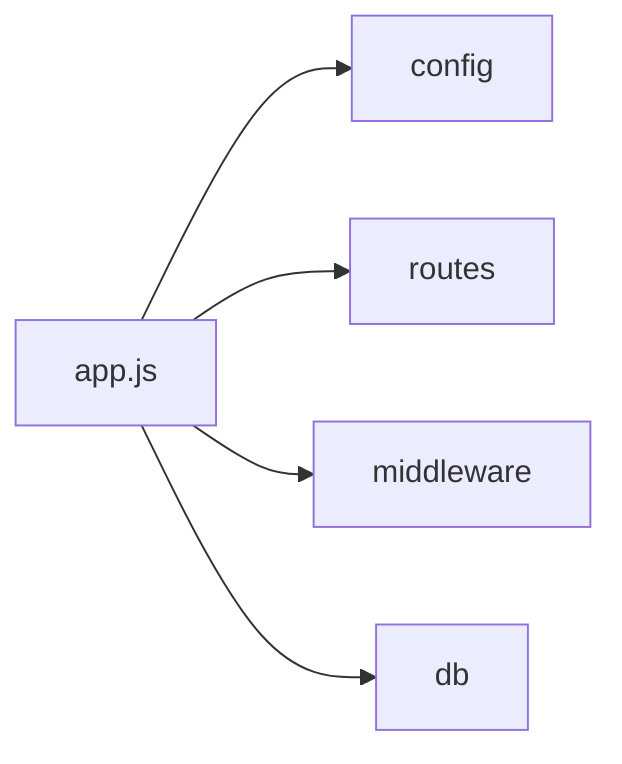

# Sprint 1 TDD - Backend Startup and Configuration

## 1. Overview & Scope
Covers backend initialization, configuration loading, and server startup.

## 2. Architecture (Mermaid)

## 3. Module Responsibilities
- app.js: express initialization, middleware, routes, error handler.
- config: loads environment variables.
- db: database connection.
 - request parsing: uses `express.urlencoded` and `express.json` (no direct body-parser usage).

## 4. Data Model / ERD
- Not applicable.

## 5. API / Route Contracts
- Not applicable.

## 6. Validation Rules
- Not applicable.

## 7. State Machine
- Not applicable.

## 8. Sequence Flow
- Not applicable.

## 9. Error Handling
- Global error handler at end of middleware chain.

## 10. Security & Access Control
- Session secret via .env.

## 11. Operational Notes
- Uses MySQL-backed sessions.
- Runs cleanup job for disabled members hourly.
 - Express 5.x is used for the server runtime.

## 12. Out of Scope
- Production deployment details.

## 13. Open Questions
- None.
