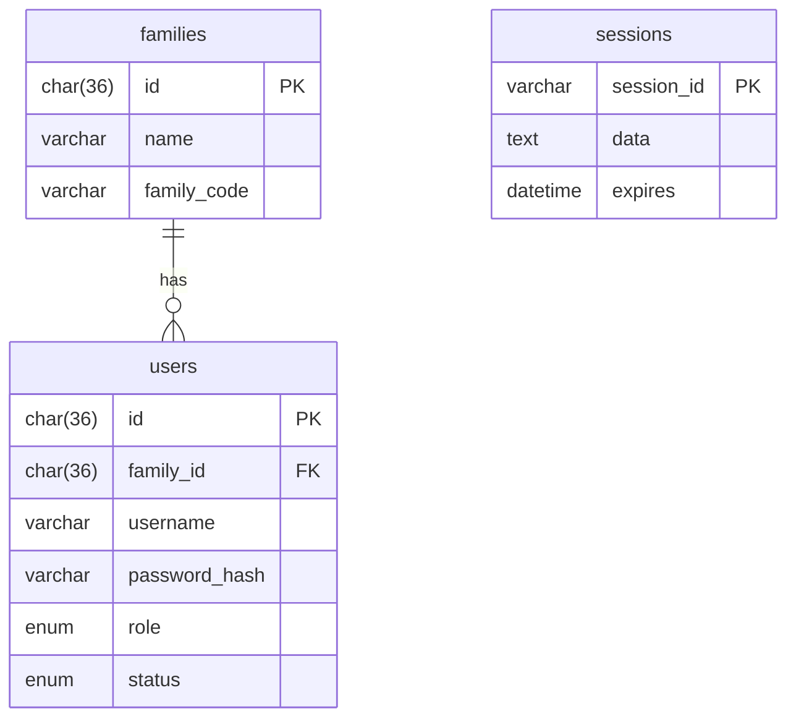

# Sprint 1 TDD - Database Design v2.1

## 1. Overview & Scope
Core tables for families, users, and sessions.

## 2. Architecture
- Not applicable.

## 3. Data Model / ERD (Mermaid)

## 4. API / Route Contracts
- Not applicable.

## 5. Validation Rules
- Not applicable.

## 6. State Machine
- Not applicable.

## 7. Sequence Flow
- Not applicable.

## 8. Error Handling
- Not applicable.

## 9. Security & Access Control
- Passwords stored as hashes.

## 10. Operational Notes
- MySQL-backed session storage.

## 11. Out of Scope
- Quest tables (Sprint 2).

## 12. Open Questions
- None.
