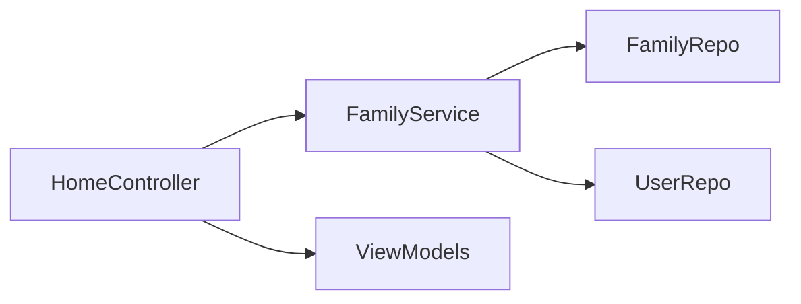
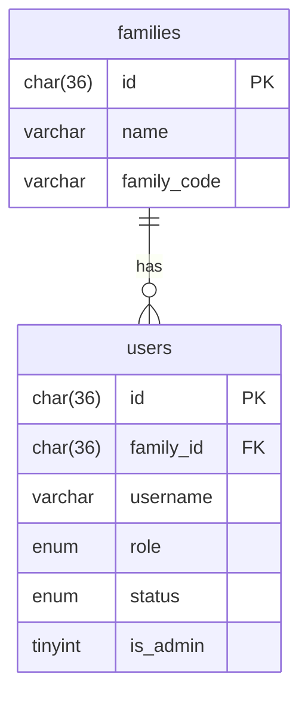
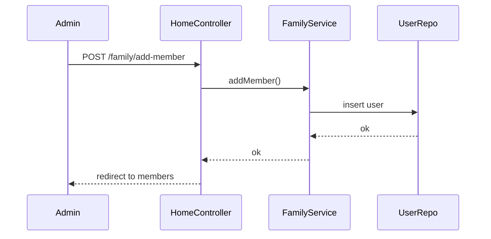

# Sprint 1 TDD - Family and Member Management

## 1. Overview & Scope
Manages family creation, member listing, and member account generation.

## 2. Architecture (Mermaid)

## 3. Module Responsibilities
- HomeController: family members pages and actions.
- FamilyService: business rules for members.
- FamilyRepo/UserRepo: DB access.
- ViewModels: prepare data for views.

## 4. Data Model / ERD (Mermaid)

## 5. API / Route Contracts
- GET /family/members
- GET /family/add-member (redirects to modal)
- POST /family/add-member
- POST /family/reset-member-password

## 6. Validation Rules
- Username required.
- Role must be parent or child.

## 7. State Machine
- Not applicable.

## 8. Sequence Flow (Mermaid)

## 9. Error Handling
- Validation errors return to members page and open modal.

## 10. Security & Access Control
- Admin-only for add/reset.

## 11. Operational Notes
- Password reset sets password to family code.

## 12. Out of Scope
- Email invites.

## 13. Open Questions
- None.
