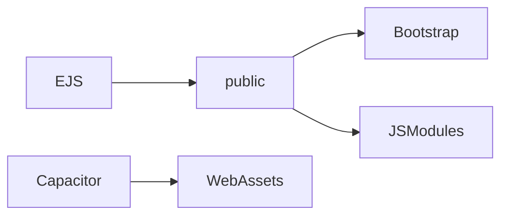

# Sprint 1 TDD - Frontend Assets and Capacitor Integration

## 1. Overview & Scope
Describes frontend asset organization and Android (Capacitor) integration.

## 2. Architecture (Mermaid)

## 3. Module Responsibilities
- EJS views: SSR templates.
- public/: CSS and JS assets.
- Capacitor: Android wrapper for web app.

## 4. Data Model / ERD
- Not applicable.

## 5. API / Route Contracts
- Not applicable.

## 6. Validation Rules
- Client validation uses HTML attributes and small JS helpers.

## 7. State Machine
- Not applicable.

## 8. Sequence Flow
- Not applicable.

## 9. Error Handling
- Frontend shows Bootstrap alerts/toasts.

## 10. Security & Access Control
- SSR pages protected by middleware.

## 11. Operational Notes
- No build step; assets served from `public`.

## 12. Out of Scope
- iOS integration.

## 13. Open Questions
- None.
