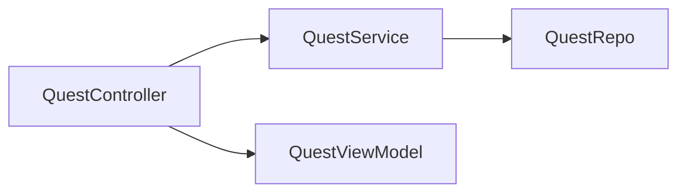
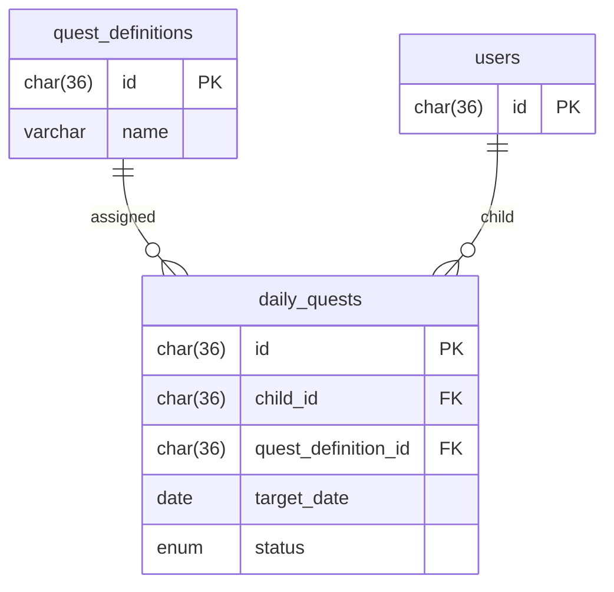
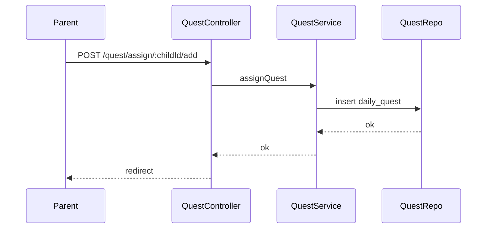

# Sprint 2 TDD - Daily Quest Assignment Design

## 1. Overview & Scope
Parents assign quest definitions to a child for Today or Tomorrow.

## 2. Architecture (Mermaid)

## 3. Module Responsibilities
- QuestController: render assign page, handle add/remove.
- QuestService: apply rules, query tasks.

## 4. Data Model / ERD (Mermaid)

## 5. API / Route Contracts
- GET /quest/assign/:childId
- POST /quest/assign/:childId/add
- POST /quest/assign/:childId/remove

## 6. Validation Rules
- questDefinitionId required.
- day in {today, tomorrow}.

## 7. State Machine
- See TD-200.

## 8. Sequence Flow (Mermaid)

## 9. Error Handling
- Duplicate assignment -> redirect with error.

## 10. Security & Access Control
- Parent-only.

## 11. Operational Notes
- Day is derived by server and active tab.

## 12. Out of Scope
- Multi-day scheduling.

## 13. Open Questions
- None.
