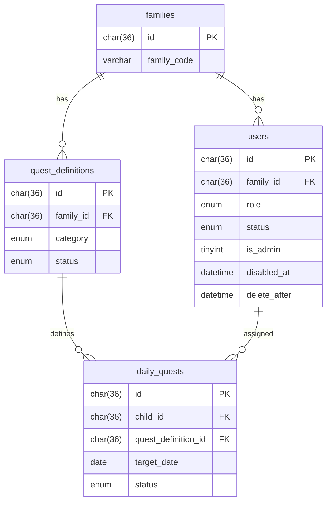

# Sprint 2 TDD - Database Schema Updates

## 1. Overview & Scope
Adds quest tables and user fields for admin flag and delayed delete.

## 2. Data Model / ERD (Mermaid)

## 3. Schema Changes
- users: add is_admin, gold_balance, gem_balance, disabled_at, delete_after
- role normalized to enum('parent','child')

## 4. New Tables
- quest_definitions
- daily_quests

## 5. Migration Script
See `workspace/tools/migrate-sprint2-schema.sql`.

## 6. Out of Scope
- Rewards logic.
