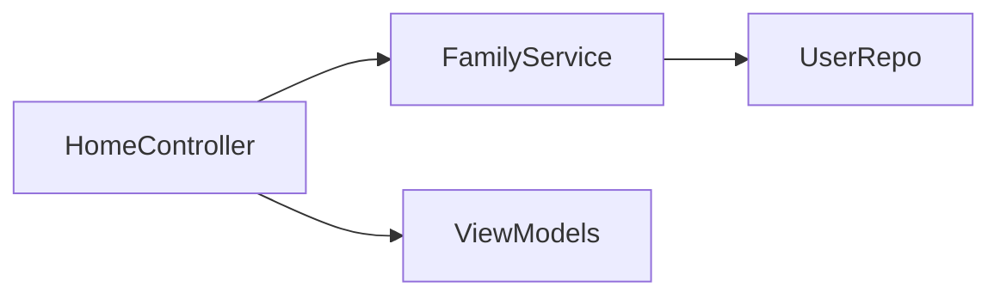
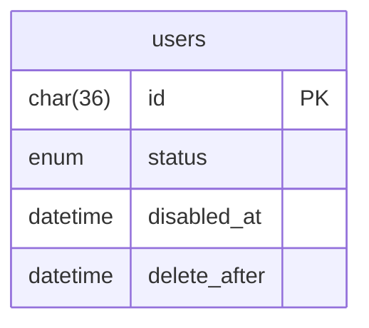
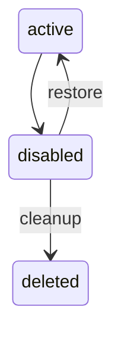
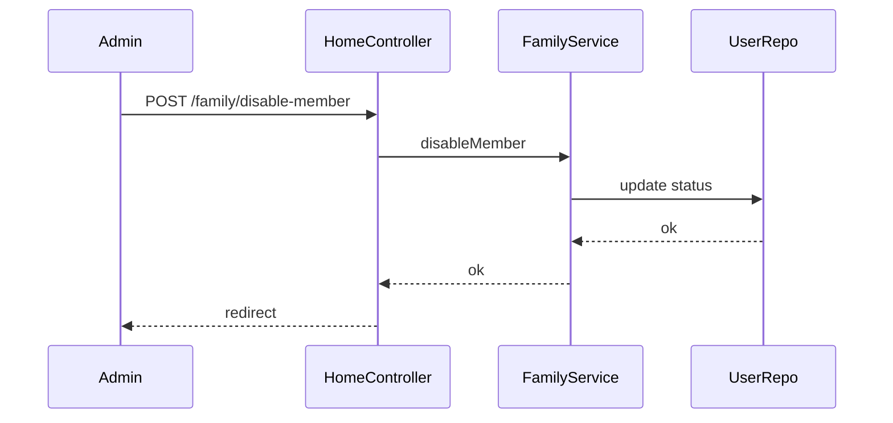

# Sprint 2 TDD - Family Member Disable/Delete

## 1. Overview & Scope
Implements delayed delete (disable) and restore for family members.

## 2. Architecture (Mermaid)

## 3. Module Responsibilities
- HomeController: disable/restore actions.
- FamilyService: update status and countdown.
- MaintenanceService: cleanup expired disabled users.

## 4. Data Model / ERD (Mermaid)

## 5. API / Route Contracts
- POST /family/disable-member
- POST /family/restore-member

## 6. Validation Rules
- memberId required.

## 7. State Machine (Mermaid)

## 8. Sequence Flow (Mermaid)

## 9. Error Handling
- Missing memberId -> redirect with error.

## 10. Security & Access Control
- Admin-only.

## 11. Operational Notes
- Cleanup job runs hourly.

## 12. Out of Scope
- Hard delete UI.

## 13. Open Questions
- None.
