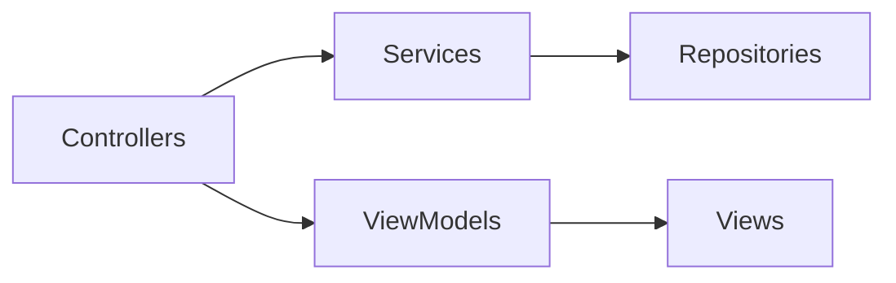
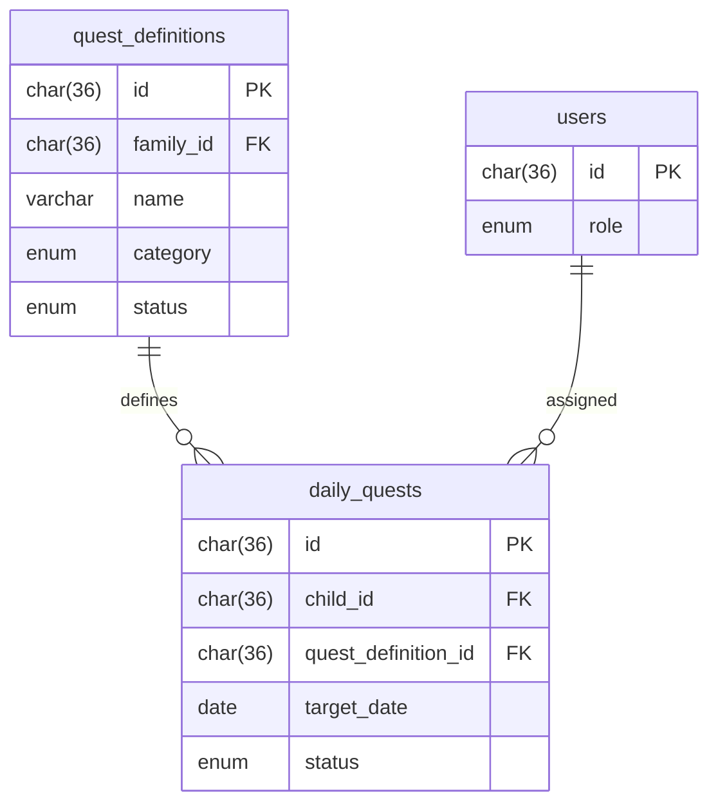
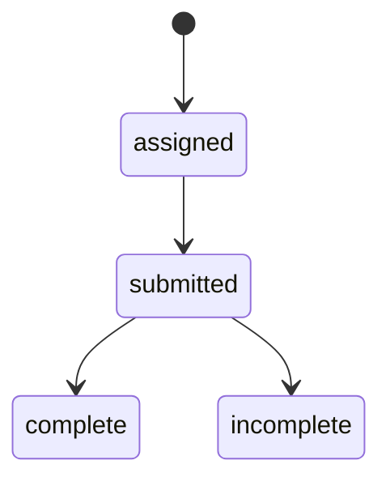

# Sprint 2 TDD - Overview and Integration Guide

## 1. Overview & Scope
Sprint 2 adds Quest management and delayed delete for family members. Views are SSR with EJS and Bootstrap.

## 2. Architecture (Mermaid)

## 3. Module Responsibilities
- Controllers: request handling.
- Services: business rules.
- Repositories: DB access.
- ViewModels: view data preparation.

## 4. Data Model / ERD (Mermaid)

## 5. API / Route Contracts
See Sprint 2 routes doc.

## 6. Validation Rules
- Central validators per feature.

## 7. State Machine (Mermaid)

## 8. Sequence Flows
- Quest assignment, submission, review (see feature docs).

## 9. Error Handling
- Redirect with query error parameters.

## 10. Security & Access Control
- requireAuth, requireRole, requirePasswordChange.
- CSRF intentionally not used.

## 11. Operational Notes
- Cleanup job removes disabled members after 3 days.
 - Forced password change hides current password input on first login/reset.

## 12. Out of Scope
- Rewards and economy.

## 13. Open Questions
- None.
