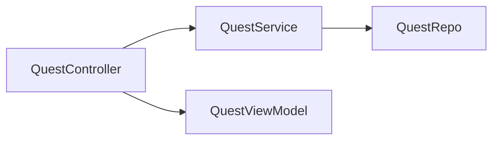
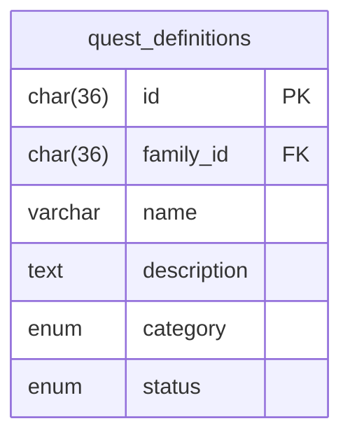
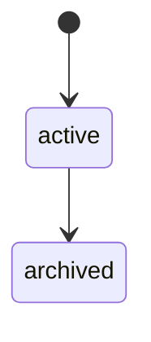
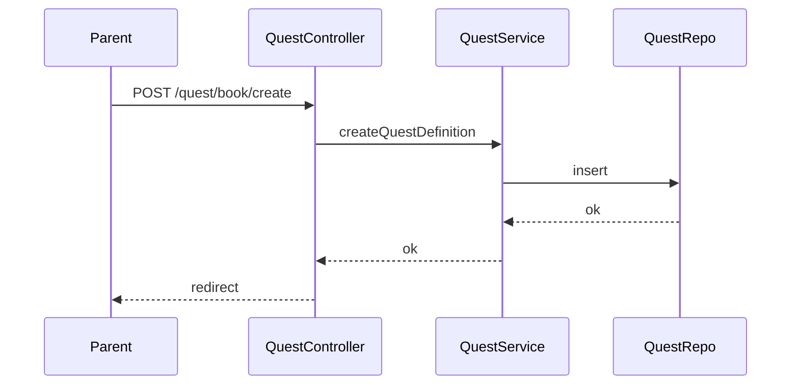

# Sprint 2 TDD - Quest Book System Design

## 1. Overview & Scope
Quest Book stores reusable quest definitions per family.

## 2. Architecture (Mermaid)

## 3. Module Responsibilities
- QuestController: renders Quest Book and handles create/edit/archive.
- QuestService: validation + persistence.
- QuestRepo: DB operations.

## 4. Data Model / ERD (Mermaid)

## 5. API / Route Contracts
- GET /quest/book
- POST /quest/book/create
- POST /quest/book/edit/:id
- POST /quest/book/archive/:id

## 6. Validation Rules
- Name required, max 120.
- Category in enum list.

## 7. State Machine (Mermaid)

## 8. Sequence Flow (Mermaid)

## 9. Error Handling
- Validation errors redirect with message.

## 10. Security & Access Control
- Parent-only.

## 11. Operational Notes
- None.

## 12. Out of Scope
- Rewards, icons.

## 13. Open Questions
- None.
