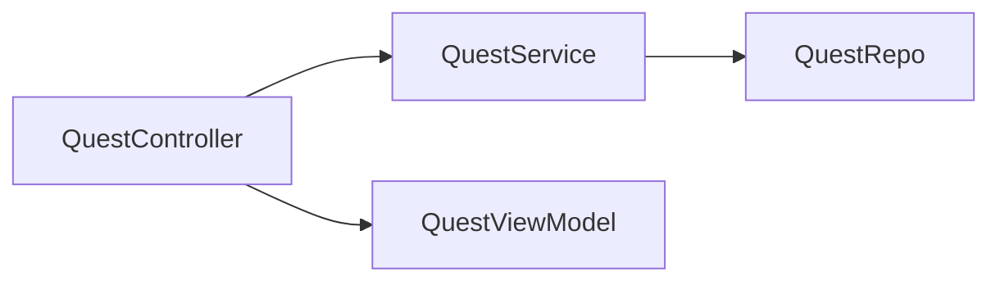
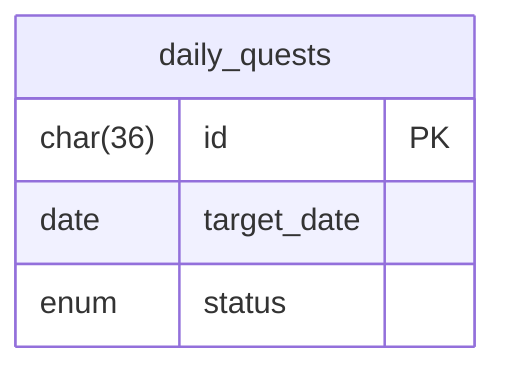
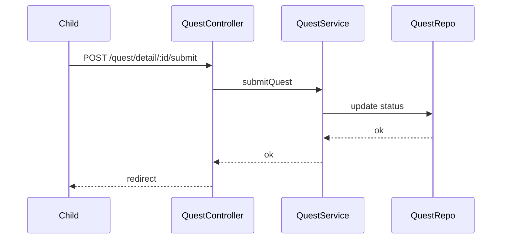

# Sprint 2 TDD - Quest Completion Submission Design

## 1. Overview & Scope
Children submit assigned quests for Today. Submission moves status to `submitted`.

## 2. Architecture (Mermaid)

## 3. Module Responsibilities
- QuestController: render quest pages and submit.
- QuestService: submission validation and update.

## 4. Data Model / ERD (Mermaid)

## 5. API / Route Contracts
- GET /quest (child)
- GET /quest/detail/:dailyQuestId
- POST /quest/detail/:dailyQuestId/submit

## 6. Validation Rules
- Only `assigned` status and Today are allowed.

## 7. State Machine
- See TD-200.

## 8. Sequence Flow (Mermaid)

## 9. Error Handling
- Invalid task -> redirect with error.

## 10. Security & Access Control
- Child-only.

## 11. Operational Notes
- Confirmation uses Bootstrap modal.

## 12. Out of Scope
- Resubmission.

## 13. Open Questions
- None.
