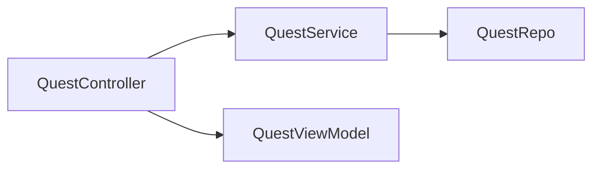
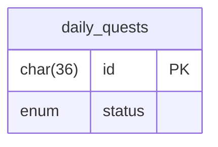
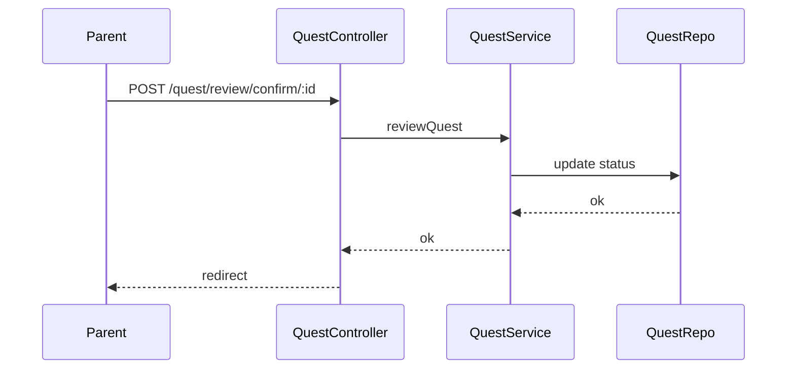

# Sprint 2 TDD - Quest Review and Confirmation Design

## 1. Overview & Scope
Parents review submitted quests and mark them complete or incomplete.

## 2. Architecture (Mermaid)

## 3. Module Responsibilities
- QuestController: render review list and handle confirm.
- QuestService: update status.

## 4. Data Model / ERD (Mermaid)

## 5. API / Route Contracts
- GET /quest/review
- POST /quest/review/confirm/:id

## 6. Validation Rules
- result in {complete, incomplete}.

## 7. State Machine
- See TD-200.

## 8. Sequence Flow (Mermaid)

## 9. Error Handling
- Invalid result -> redirect with error.

## 10. Security & Access Control
- Parent-only.

## 11. Operational Notes
- Confirmation uses Bootstrap modal.

## 12. Out of Scope
- Comments, attachments.

## 13. Open Questions
- None.
