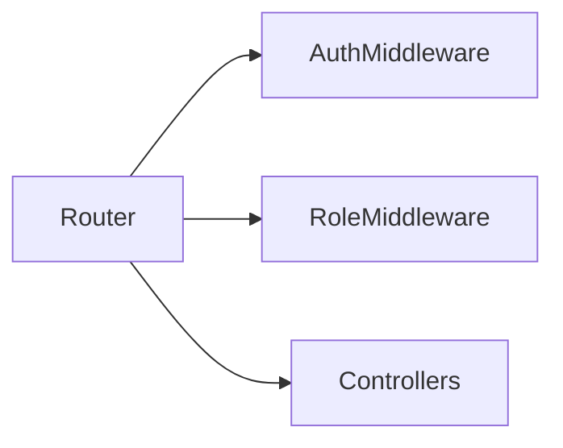

# Sprint 2 TDD - Routes and Middleware Updates

## 1. Overview & Scope
Defines routes and middleware protections for Sprint 2 features.

## 2. Architecture (Mermaid)

## 3. Module Responsibilities
- Middleware enforces authentication, role, and password change.

## 4. API / Route Contracts
Parent:
- GET /quest
- GET /quest/book
- POST /quest/book/create
- POST /quest/book/edit/:id
- POST /quest/book/archive/:id
- GET /quest/assign/:childId
- POST /quest/assign/:childId/add
- POST /quest/assign/:childId/remove
- GET /quest/review
- POST /quest/review/confirm/:id

Child:
- GET /quest
- GET /quest/today
- GET /quest/tomorrow
- GET /quest/detail/:dailyQuestId
- POST /quest/detail/:dailyQuestId/submit

Family:
- GET /family/members
- GET /family/add-member (redirects to members with modal)
- POST /family/add-member
- POST /family/disable-member
- POST /family/restore-member
- POST /family/reset-member-password

## 5. Validation Rules
- Route params validated in validators.

## 6. Error Handling
- Redirect with query error.

## 7. Security & Access Control
- requireAuth, requireRole, requirePasswordChange.
- CSRF intentionally not used.

## 8. Out of Scope
- Public APIs.
