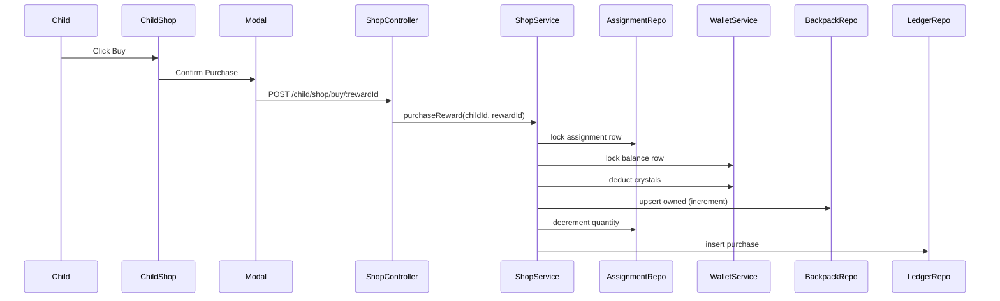

# Sprint 3 TDD - Child Shop and Backpack

## 1. Overview
Child sees assigned rewards, purchases with crystals, and views backpack.

## 2. Purchase Flow (Mermaid)

## 3. Display Rules
- Show all assigned rewards, even inactive or quantity 0 (greyed).
- Quantity 0 shows `x0` and disables purchase.
- Insufficient balance: toast "Insufficient balance".

## 4. Backpack UI
- Home row: top 5 items by quantity, ties by name A?Z.
- Modal: 5x5 grid, pages by owned item-type count.
- Pagination: total pages = ceil(itemTypeCount / 25).

## 5. Sorting
- All lists sorted by quantity desc, name asc.

## 6. Out of Scope
- Item usage and wish tree submission.
- Multi-device concurrent purchases. Purchases are processed in transaction order.
