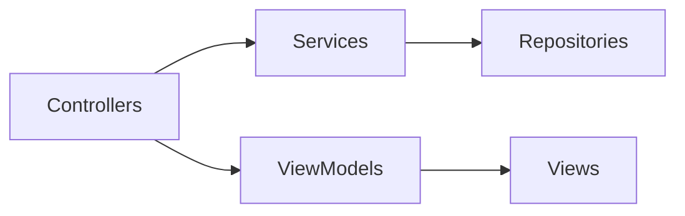
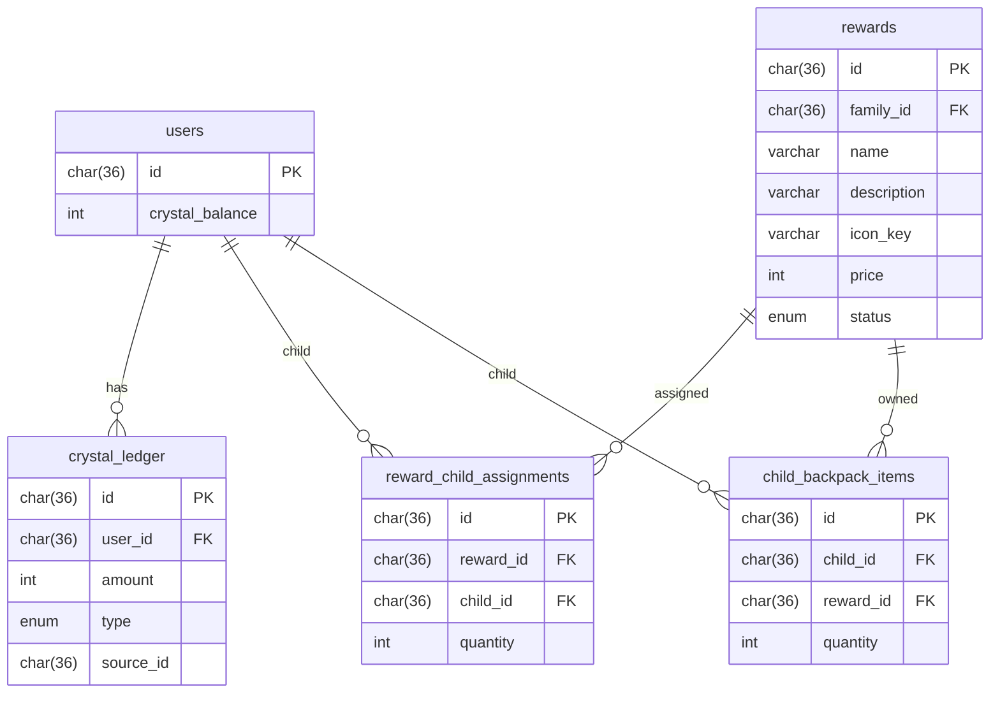

# Sprint 3 TDD - Overview and Integration Guide

## 1. Overview & Scope
Sprint 3 adds the Quest ? Crystal ? Shop ? Backpack loop, crystal wallet display, and reward shop management.

## 2. Architecture (Mermaid)

## 3. Module Responsibilities
- Controllers: HTTP request handling and redirects.
- Services: business rules (rewards, purchases, wallet updates).
- Repositories: DB access.
- ViewModels: prepare view data for SSR templates.

## 4. Data Model / ERD (Mermaid)

## 5. Integration Points
- Quest Review: when marking `complete`, issue crystal rewards and write ledger.
- Parent Shop: shop home + reward library CRUD + per-child assignment.
- Child Shop: purchase flow updates inventory and ledger.
- Header UI: display crystal balance for child only.

## 6. Validation Rules
- Reward name <= 50 chars, description <= 120 chars.
- Price in [1, 9999].
- Quantity per child >= 0.
- Icon key must be in fixed list.

## 7. Error Handling
- Redirect with query error parameters.
- Toast messages for user feedback.

## 8. Security & Access Control
- requireAuth, requireRole, requirePasswordChange.
- CSRF intentionally not used.

## 9. Out of Scope
- Essence economy, wish tree logic, ledger UI.
