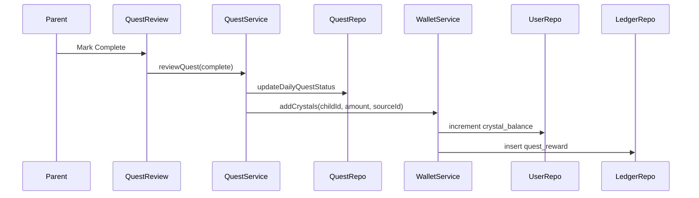

# Sprint 3 TDD - Quest Rewards

## 1. Overview
Adds base crystal input to quest definitions and issues rewards on parent confirmation.

## 2. Data Fields
- `quest_definitions.base_crystals` stores the reward amount.
- `users.crystal_balance` holds current balance.
- `crystal_ledger` records reward issuance.

## 3. Flow (Mermaid)

## 4. Business Rules
- Reward issued only on first transition to `complete`.
- `complete` and `incomplete` are terminal states.
- Base crystals must be a non-negative integer.

## 5. Validation
- Base crystals: integer, 0-9999.

## 6. Error Handling
- If quest already `complete`, do not issue reward.

## 7. Out of Scope
- Multipliers, bonus, or streak rewards.
