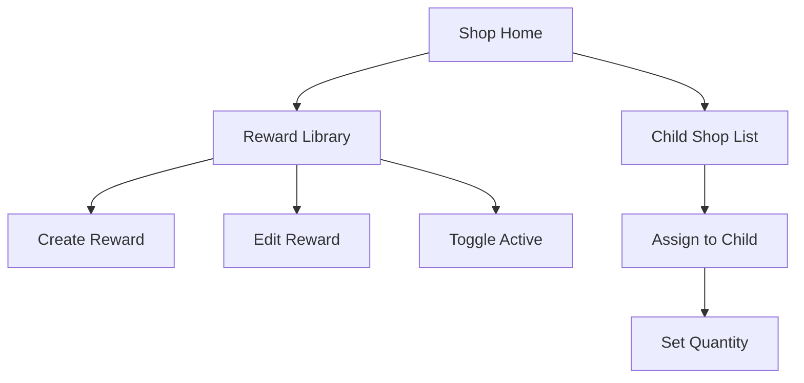

# Sprint 3 TDD - Reward Shop Management (Parent)

## 1. Overview
Parent manages reward library and assigns rewards to children with quantity.

## 2. Icon Options
Fixed list of 10 icons:
`gift`, `book`, `game`, `sports`, `snack`, `outdoor`, `music`, `art`, `pet`, `star`.

## 3. Flows

## 4. Validation Rules
- Name: required, max 50 chars.
- Description: required, max 120 chars, default "Magic Gift".
- Price: integer 1?9999.
- Icon: must be in fixed list.
- Quantity: integer >= 0.

## 5. Data Access
- rewards: insert/update/toggle status.
- reward_child_assignments: upsert per child.

## 6. UI Notes
- Shop home mirrors Quest Home (entry + child selection).
- Reward library mirrors Quest Book (list + modal create/edit).
- Child shop list mirrors Quest Assign (per-child list + modal add reward).

## 7. Out of Scope
- Icon upload.
