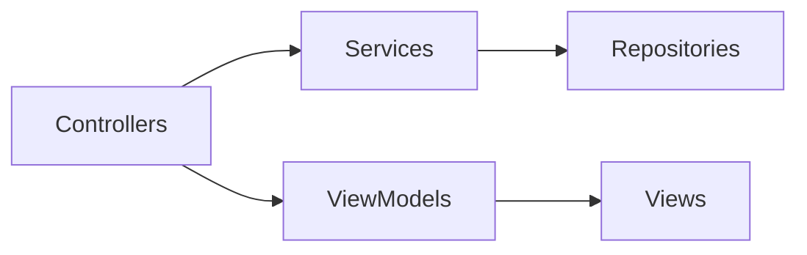

# Sprint 4 TDD - Overview

## 1. Scope
Sprint 4 delivers three features:
- Calendar (monthly completion view for parent/child)
- Mailbox messages (crystal earn/spend + quest failed)
- Reward icon rendering (Bootstrap Icons)

## 2. High-Level Architecture

## 3. Modules & Ownership
- Calendar
  - Controller: `calendarController`
  - Service: `calendarService`
  - ViewModel: `calendarViewModel`
  - View: `calendar.ejs`
- Mailbox
  - Controller: `mailboxController`
  - Service: `mailboxService`
  - Repo: `mailboxRepo`
  - View: modal mailbox via `main.js`
- Reward Icons
  - Service: `rewardService` (icon key list)
  - Controller: `shopController` mapping to Bootstrap classes
  - Views: parent/child shop

## 4. Security & Access Control
- `requireAuth`, `requirePasswordChange`
- Calendar + Mailbox: parent & child only
- Shop icon selection: parent only

## 5. Risks & Mitigations
- Date drift from UTC conversion -> use server-local date formatting
- Mailbox unread badge out of sync -> refresh count after mark-read
- Large monthly data -> single aggregated query

## 6. Test Checklist (High-Level)
- Calendar displays correct month, selection, and completion rates
- Parent sees aggregate rate and child tabs
- Mailbox shows list, unread badge, and per-item read state
- Reward icons render and selection persists
