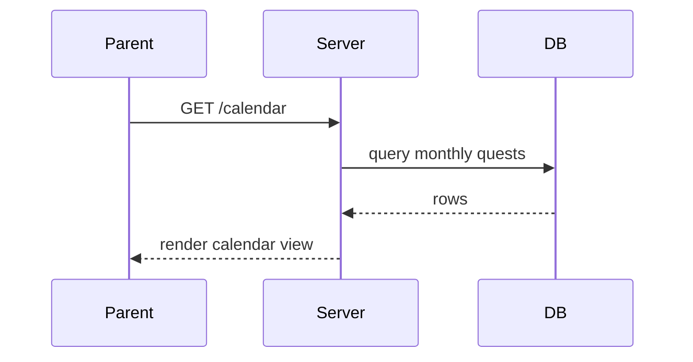

# Sprint 4 TDD - Overview and Integration Guide

## 1. Integration Points
- Calendar aggregates `daily_quests` with quest definitions
- Mailbox messages written in `walletService` and quest review flow
- Reward icon rendering uses `icon_key` mapping

## 2. Data Flow (Sequence)

## 3. Component Boundaries
- Controllers assemble data and render SSR views
- Services handle business rules and aggregation
- Repositories are single-purpose DB access
- ViewModels format data for templates

## 4. Error Strategy
- User-facing errors via query `?error=` and toast
- API errors return JSON for mailbox routes

## 5. Out of Scope
- Wish Tree systems
- Admin operations
